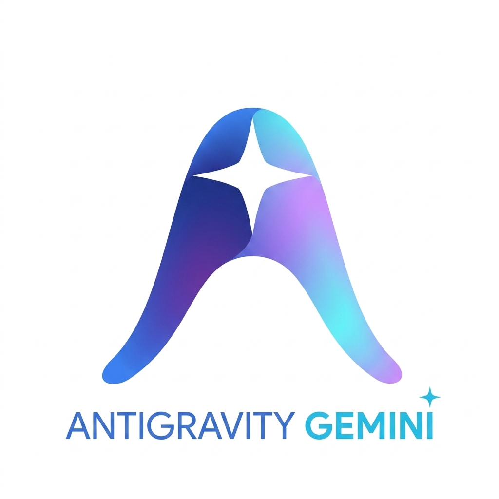

<div align="center">



# Antigravity Enhance Tools (Antigravity 扩展增强工具)
### 全界面原生深度汉化与原生 UI 交互增强套件

**让 Google Antigravity 桌面客户端获得全界面原生深度汉化、真实上下文动态遥测、4 挡思考调节滑块、实时额度看板与现代沉浸式原生视觉增强**

[](https://github.com/)
[](LICENSE)
[](https://github.com/)
[](https://github.com/)
[](https://github.com/)

</div>

---

## 🌟 视觉展示 (Showcase)

### 1. 现代化双主题 GUI 安装向导 (`Antigravity增强与汉化工具.exe`)
支持在窗口右上角实时一键无缝切换「☀️ 浅色明亮」与「🌙 深色极夜」主题，具备路径自动识别、平滑进度条与滚动控制台日志：

| ☀️ 现代浅色模式 (默认) | 🌙 深色极夜模式 (一键切换) |
| :---: | :---: |
|  |  |

### 2. 客户端内嵌增强功能实测
客户端运行时丝滑流畅，彻底消除死循环，毫秒级响应每一轮对话交互：

| 实时上下文用量浮窗与底栏彩色胶囊 | 模型选择菜单 4 挡思考能力动态滑块 |
| :---: | :---: |
|  |  |

---

## ✨ 核心特性矩阵 (Feature Matrix)

| 功能特性 | 说明描述 | 状态 |
| :--- | :--- | :---: |
| **🈳 全界面深度汉化** | 全面汉化原生客户端顶部菜单栏、视窗、侧边栏导航、对话输入框、配置弹窗及各组件提示语，100% 词条覆盖率。 | ✔ 已就绪 |
| **📈 真实上下文动态监测** | 监听底层响应式状态，每发送一轮消息、执行一个工具或生成回复，上下文用量与 Token 毫秒级即时更新。 | ✔ 已就绪 |
| **🎯 模型上下文上限自适应** | 动态适配不同模型最大额度：**Gemini 1.05M**、**Claude 4.6 250K**、**Claude 3.7/3.5 200K**、**GPT 系列 128K**，拒绝固定虚假数值。 | ✔ 已就绪 |
| **🌈 五层分段占比卡片** | 细化呈现「🔵已缓存上下文」、「🟢输入载荷」、「🟣思维推理」、「🔴回复生成」与「⚪剩余可用量」，内置 `/compact` 压缩快捷指令。 | ✔ 已就绪 |
| **🧠 思考能力 4 挡动态滑块** | 嵌入模型切换面板，提供「关闭 / 低 / 中 / 高」四挡顺滑拖拽调节，绑定当前选定模型，最高挡尊享紫粉微光。 | ✔ 已就绪 |
| **📊 实时额度与消耗面板** | 侧边栏常驻实时额度卡片，支持 Gemini / Claude 额度多周期轮询与手动刷新。 | ✔ 已就绪 |
| **💎 极简淡色 PRO 徽标** | 替换原高饱和刺眼标识，改用优雅低调的淡紫微光 PRO 胶囊勋章，与整体暗色/亮色风格完美契合。 | ✔ 已就绪 |
| **✨ 现代视效与原生沉浸交互** | 重构应用视觉标识体系，深度适配现代沉浸式交互流与暗/浅色界面视觉规范。 | ✔ 已就绪 |
| **🛡️ 防死循环守护引擎** | 独创 **DOM 缓存守卫（Cache Guard）** 与主控防重入锁，彻底杜绝 MutationObserver 递归卡死与内存映射字节码损坏。 | ✔ 已就绪 |
| **📦 零依赖单文件 GUI 安装器** | 基于原生 C# / WPF 编译，无须安装任何额外环境，双击即开，集安装、更新、还原于一体。 | ✔ 已就绪 |

---

## 🚀 快速开始 (Quick Start)

### 方式一：使用独立 GUI 安装器 (推荐)
1. 从 [Releases](https://github.com/) 页面下载最新版 **`Antigravity增强与汉化工具.exe`**。
2. 双击直接运行（无需安装额外运行库）。
3. 程序将自动检测您的 Antigravity 安装目录，确认无误后点击 **「🚀 一键安装 / 更新增强补丁」**。
4. 安装完成后，程序将自动重新启动客户端，即可享受全新的交互与汉化体验！
5. 若需恢复官方原版，随时点击 **「↺ 一键还原官方原版」** 即可。

### 方式二：使用离线归档扩展包
1. 下载 **`Antigravity-Enhance-Pack.zip`** 并解压。
2. 运行目录内的 `Antigravity增强与汉化工具.exe`。
3. 随时随地随拷随用，换电脑、重装系统皆可一键生效。

---

## 🛠️ 从源码构建 (Build from Source)

本项目完全开源，您可以自行检视所有代码并一键编译：

### 环境要求
- **操作系统**：Windows 10 / Windows 11 (x64)
- **编译工具**：Windows 自带的 `csc.exe` (.NET Framework 4.0+)
- **脚本引擎**：Node.js 18.0 或更高版本

### 一键构建流程
```bash
# 1. 克隆代码仓库
git clone https://github.com/your-username/antigravity-enhance-pack.git
cd antigravity-enhance-pack

# 2. 执行构建脚本 (自动完成资源内嵌打包与 C# GUI 编译器调用)
node build.js

# 或者直接双击运行
build.bat
```
构建成功后，将在当前目录输出单文件独立可执行程序 `Antigravity增强与汉化工具.exe`。

---

## 📂 项目结构 (Repository Structure)

```
Antigravity-Enhance-Pack/
├── assets/                          # 界面预览截图与品牌 Logo 资源
│   ├── gui_installer_light_preview.png
│   ├── gui_installer_dark_preview.png
│   ├── verified_anti_freeze_live.png
│   ├── verified_model_slider_live.png
│   └── logo_v3_transparent.png
├── core/                            # 核心注入运行时与词条资源
│   ├── i18n_runner.js               # 客户端注入脚本 (DOM 缓存守卫、实时上下文、滑块逻辑)
│   ├── i18n_data.json               # 深度汉化词条对照字典
│   ├── icon.png                     # 高清聚变品牌图标 (PNG)
│   ├── app.ico                      # Windows 原生图标文件 (ICO)
│   └── node_modules/                # 解包与封包核心依赖 (@electron/asar)
├── src/                             # 安装包源码目录
│   ├── InstallerApp.cs              # 双主题现代化 WPF GUI 安装器源码
│   ├── patcher.js                   # 自动化解包、注入与原子化部署引擎
│   └── unpatcher.js                 # 官方原生纯净版还原脚本
├── build.js                         # 自动化资源打包与 C# 编译管线
├── build.bat                        # Windows 批处理一键构建脚本
├── .gitignore                       # Git 忽略配置
├── LICENSE                          # MIT 开源许可证
└── README.md                        # 项目官方中英文档
```

---

## 🛡️ 技术原理与架构设计

### 1. 独创 DOM 缓存守卫 (Cache Guard)
为解决 Electron + React 单页架构下频繁的 DOM 树重绘引发的监听器循环震荡问题，在所有注入点实施了强一致性缓存守卫：
```javascript
// 仅在真实内容发生变更时才允许操作 DOM 节点，彻底杜绝无谓重绘与事件循环死锁
if (trigger.__agyLastHTML !== newHTML) {
    trigger.__agyLastHTML = newHTML;
    trigger.innerHTML = newHTML;
}
```

### 2. 毫秒级动态上下文响应式订阅
通过智能探测 React Fiber 树上的 `agentStateProvider` 实例并建立事件监听：
```javascript
// 挂载响应式信号：当对话步骤与 Token 状态产生变化时，毫秒级更新底栏胶囊与浮窗卡片
asp.onDidChange(() => {
    if (typeof window.__AGY_MOUNT_CONTEXT_USAGE__ === 'function') {
        window.__AGY_MOUNT_CONTEXT_USAGE__();
    }
});
```

### 3. 原子化安全部署机制
避免热写运行中进程的内存映射文件（V8 Bytecode Memory Mapping），独立 GUI 工具采用进程互斥检测与原子替换流程：
`优雅退出进程 -> 释放文件锁定 -> 备份原版 asar -> 注入核心钩子 -> 原子封包 -> 部署生效 -> 自动唤起客户端`。

---

## ⚖️ 免责声明 (Disclaimer)

- 本项目为社区开源项目，仅供技术交流与学习参考。
- Antigravity 与 Google Gemini 是其对应所有者的商标。本项目与之无官方隶属关系。
- 软件已提供一键还原官方功能，备份文件将始终保存在 `resources/app.asar.bak`。

---

## 📄 开源许可证 (License)

本项目基于 [MIT License](LICENSE) 协议完全开源，允许自由使用、分发与二次修改。欢迎提交 PR 与 Issue！
