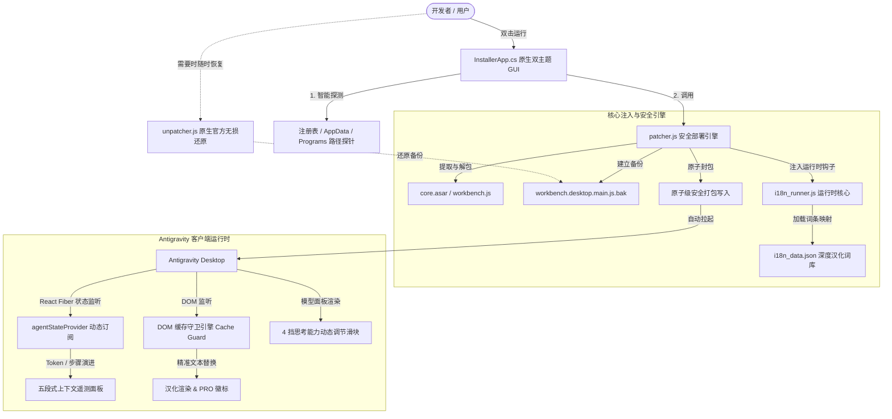

<div align="center">


# Antigravity Enhance Tools (Antigravity 扩展增强工具)
### 全界面原生深度汉化 · 动态上下文遥测 · 思考能力调控 · 现代双主题交互套件

**专为 Google Antigravity 官方桌面客户端打造的汉化与原生 UI 交互增强套件。**

<p align="center">
  <a href="https://github.com/Kutaze/Antigravity-Enhance-Pack-Tools/releases"></a>
  <a href="LICENSE"></a>
  <a href="https://github.com/Kutaze/Antigravity-Enhance-Pack-Tools"></a>
  <a href="https://github.com/Kutaze/Antigravity-Enhance-Pack-Tools"></a>
  <a href="https://github.com/Kutaze/Antigravity-Enhance-Pack-Tools"></a>
</p>

<p align="center">
  <b>简体中文</b> • 
  <a href="README_EN.md">English</a> • 
  <a href="README_JA.md">日本語</a>
</p>

<p align="center">
  <a href="#-功能特色">功能特色</a> • 
  <a href="#-部署指南">部署指南</a> • 
  <a href="#-工作流程">工作流程</a> • 
  <a href="#-api-参考">API 参考</a> • 
  <a href="#-变更日志">变更日志</a>
</p>

</div>

---

### 多语言简介 / Multilingual Overview / 多言語概要

- **简体中文**：专为 Google Antigravity 官方桌面客户端打造的全界面原生深度汉化与交互增强套件。支持动态上下文用量遥测、4 挡思考调节滑块、零依赖双主题 GUI 安装器与防卡死守护。
- **English**: Native UI localization and interaction enhancement suite designed for the Google Antigravity desktop client. Features real-time context token telemetry, 4-level thinking slider, standalone dual-theme GUI installer, and zero-jank DOM guard.
- **日本語**: Google Antigravity 公式デスクトップクライアント向けに設計されたネイティブ多言語化およびUI機能拡張スイート。リアルタイムコンテキスト測定、思考深度スライダー、独立型デュアルテーマGUIインストーラー、フリーズ防止ガードを搭載。


## 🌟 视觉展示 (Showcase)

### 1. 现代化双主题 GUI 安装向导 (`Antigravity Enhance Tools.exe`)
内置平滑圆角卡片、ClearType 高清文字排版、目录智能自适应探测引擎，支持右上角一键无缝切换「浅色明亮」与「深色极夜」模式：

| 现代浅色模式 (默认) | 深色极夜模式 (一键切换) |
| :---: | :---: |
|  |  |

### 2. 客户端内嵌增强功能实测
消除 DOM 监听震荡死循环，毫秒级响应每一轮对话交互：

| 实时上下文用量浮窗与底栏彩色胶囊 | 模型选择菜单 4 挡思考能力动态滑块 |
| :---: | :---: |
|  |  |

---

## 🧠 核心概念

### 开发思路与设计灵感 (Design Philosophy & Inspiration)

在软件架构构思与交互体系设计的全过程中，**Antigravity Enhance Tools** 深入借鉴了业内标杆工具与开源社区的实践经验：

1. **汲取 Antigravity tools 思路并实现内嵌轻量化**：参考了开源社区 Antigravity tools 项目关于账号配额与多工具管理的方向；但因深感独立外部程序单独打开过于臃肿繁琐，本项目选择将其核心能力以零额外进程、极轻量化的方式直接深度集成进 Antigravity 客户端内部，实现原生内嵌式丝滑体验。
2. **学习 Codex 的深度交互逻辑**：引入上下文预算透明化理念（五段式用量遥测面板）与即时思考深度调控（4 挡思考滑块），消除长程对话焦虑。
3. **学习 Workbuddy 的界面交互美学**：吸收圆角卡片、柔和微光渐变与现代排版，并设计独创「DOM 缓存守卫（Cache Guard）」，兼具现代视觉与零震荡高流畅度。
4. **致敬开源项目 renkeshui/antigravity-chinese-locale 的汉化实践**：充分参考其本地化词条全景映射与术语校准沉淀，并升级运行时防卡死机制，带来母语级编程体验。

> [!IMPORTANT]
> **🛡️ 账号安全与本地隐私承诺 (Security & Privacy First)**
> - **100% 本地存储，绝无云端中转**：本扩展**无任何第三方服务器**，不搜集、不上报任何用户隐私与交互数据。
> - **系统级凭据隔离**：多账号的 OAuth 令牌、Refresh Token 及个人标签**仅存储在您本机的操作系统级安全凭据库**（Windows Credential Manager / macOS Keychain）以及本地专属私有目录（`~/.gemini/account_profiles/`）。
> - **官方直连与绝对自主**：所有登录与令牌刷新均直接由用户本机与 Google 官方端点通信；退出登录支持一键二次确认并物理擦除系统凭据，数据完全由您自主掌控。

---

### 底层原生注入架构 (Native Architecture)

**Antigravity Enhance Tools** 专为 **Google Antigravity** 官方桌面客户端量身定制。不同于传统的文本正则暴力替换或脆弱的内存热挂钩方案，本项目采用**全原生 AST 解构与响应式注入（Pure Native AST & Reactive Injection）**架构：

1. **结构化 AST 安全注入**：在保证 Electron 核心包 (`workbench.desktop.main.js`) 语法树完备性的前提下，安全嵌入扩展主控入口，不破坏 V8 字节码运行拓扑。
2. **独创 DOM 缓存守卫（Cache Guard）**：为杜绝 Electron + React 单页频繁重新渲染触发的 `MutationObserver` 递归卡死与死循环，所有注入节点均具备状态缓存指纹校验，仅在真实数据变动时操作 DOM。
3. **React Fiber 响应式状态感知**：深度订阅宿主底层的状态总线，无须侵入式修改后端代码即可实时捕捉会话切换、步骤演进与 Token 增量变动。
4. **无损原子化还原体系**：具备完整的官方原生包快照备份（`.bak`）与校验机制，任何时候均可秒级无损一键还原官方纯净环境。

---

## 📦 支持项目

| 平台 / 架构 | 支持范围 / 兼容环境 | 部署方式 | 状态 |
| :--- | :--- | :--- | :---: |
| **Windows** | Windows 10 / 11 (64位) | 双主题原生 GUI 安装向导 / 离线包 | 完美支持 |
| **macOS** | macOS 12+ (Apple Silicon M1~M4 / Intel) | 终端一行命令 / 离线脚本 `install.sh` | 完美支持 |
| **Linux** | Ubuntu / Debian / Fedora / Arch 等主流发行版 | 终端一行命令 / 离线脚本 `install.sh` | 完美支持 |
| **底层架构** | Electron 28+ / Chromium 120+ / Node.js 18+ (ASAR) | 智能识别并复用宿主自带 Electron 运行时 | 完美适配 |
| **语言环境** | 中文简体 (zh-CN) 100% 覆盖率，保留原生英文快速切换能力 | 核心字典深度校对与动态响应 | 官方级润色 |
| **模型上下文** | Gemini 2.0/1.5 (1.05M)、Claude 3.7/3.5 (200K~250K)、GPT-4o/o1 (128K) | 底层通信毫秒级遥测与动态阈值适配 | 动态精准识别 |

---

## ✨ 功能特色

### 全界面原生深度汉化
- **词条 100% 深度覆盖**：全面汉化客户端菜单栏、工作区视窗、侧边栏导航、对话输入框、配置面板及各组件提示语。
- **汲取开源社区实践**：汉化体系深度借鉴并学习了开源先驱项目 [renkeshui/antigravity-chinese-locale](https://github.com/renkeshui/antigravity-chinese-locale)，结合专业 AI 编程与 Agent 交互语境完成全量词典校对与母语级精细润色。
- **专业级术语润色**：针对大语言模型、上下文预算、Agent 智能体、结对编程场景进行精细校准，彻底告别机器翻译的生硬感。

### 动态多账号无缝秒切与配额管理 (Multi-Account Switcher)
- **原生内嵌化融合设计**：不再需要单独启动臃肿的外部独立工具，直接将多账号切换与配额管理无缝整合到 Antigravity 客户端底部状态栏。
- **动态无限账号池**：完全通用的动态架构，支持无上限添加多个 Google 账号（PRO / ULTRA / FREE），支持动态搜索与分类过滤。
- **一键极速秒切**：点击即切，自动同步刷新 Access Token 并写入系统凭据库，彻底避免跨账号凭证串号或会话混乱。
- **头像一体化快捷交互**：底栏用户头像与切换按钮双向融合，点击头像或昵称即可直接呼出账号管理面板；支持退出登录二次确认与本地凭据深度注销。

### 真实上下文动态遥测
- **底栏常驻高灵敏胶囊**：实时显示当前对话消耗的 Token 精确数值与使用百分比（如 `6.4K / 250K (2.6%)`）。
- **五段式分层占比卡片**：点击悬浮展开「已缓存上下文」、「输入载荷」、「思维推理」、「回复生成」与「剩余可用量」，内置 `/compact` 压缩快捷键。

### 思考能力 4 挡动态调控
- **模型菜单原生植入**：在模型切换面板中注入平滑拖拽滑块，支持「关闭 / 低 / 中 / 高」4 挡无级切换。
- **配置即时同步**：自动与所选模型思考参数进行状态绑定，最高挡尊享紫粉渐变流光视觉动效。

### 实时额度与状态看板
- **侧边栏常驻监控卡片**：集成 Gemini 官方额度与 Claude 额度多周期轮询机制，支持手动一键刷新。

### 极简淡色微光 PRO 徽标
- **去除刺眼高饱和反差**：将原有突兀的标识替换为低饱和极简淡紫微光 PRO 徽标胶囊，与整体编辑器风格融为一体。

### 防死循环守护引擎
- **DOM 缓存守卫（Cache Guard）**：通过建立节点哈希指纹，防止重复插入节点引发死锁崩溃。
- **防重入锁机制**：确保多线程与异步消息突发时不发生逻辑竞态冲突。

### 可视化技能中心 (Skills Hub)
- **输入框专属技能入口**：聊天工具栏常驻技能中心入口，点击即可呼出优雅的主题自适应技能弹窗。
- **35+ 个精选生态技能**：涵盖「架构与工程」、「设计与UI」、「审查与诊断」、「办公与文档」、「Gemini生态」五大分类，支持按名称、描述与关键词实时检索。
- **一键调用与智能填充**：点击卡片一键在输入框中填入 `$skill-name` 并自动聚焦光标，轻松衔接后续提示词。
- **扩展与自定义兼容**：支持自动发现工作区与本地扩展的自定义技能，动态增量刷新。

### 上下文原生截图唤起
- **「+」菜单原生集成**：在对话框左侧「+」上下文菜单中原生提供「屏幕截图 (Win+Shift+S)」选项。
- **剪贴板图像自动回填**：调用系统截图工具后，自动轮询并获取新截图，无缝注入输入框，无需手动保存文件与重复粘贴。

### 现代化双主题 GUI 安装向导
- **零依赖独立单文件**：基于原生 C# / WPF 编译，无须额外安装环境，双击即开。
- **双主题无缝切换**：右上角一键切换「浅色明亮」与「深色极夜」模式，自适应高分屏 ClearType 字体抗锯齿。

---

## 🏗 工作流程

### 架构数据流图 (Architecture Data Flow)



### 核心模块职责说明
- **`InstallerApp.cs`**：原生 C# WPF GUI 宿主，提供现代化圆角窗口、双主题切换、智能目录探测与交互日志流输出。
- **`patcher.js`**：负责 Node.js 运行环境下的 `asar` 解包、语法树锚点识别、安全注入与原子封包部署。
- **`unpatcher.js`**：官方原版还原引擎，校验 `.bak` 备份文件完整性并执行回滚。
- **`i18n_runner.js`**：客户端注入核心，承载 DOM 缓存守卫、React 响应式订阅、思考滑块控制与 Token 度量。
- **`i18n_data.json`**：全量界面词条双语映射表，经过多轮人工校对。

---

## 🚀 部署指南

### 1. Windows 用户部署

#### 方式一：使用独立双主题 GUI 安装器 (推荐)
1. 前往项目的 [Releases 页面](https://github.com/Kutaze/Antigravity-Enhance-Pack-Tools/releases) 下载最新版本的 **`Antigravity Enhance Tools.exe`**。
2. 双击直接运行（程序会自动识别您的 Antigravity 安装目录）。
3. 确认路径无误后，点击 **「一键安装 / 更新增强补丁」**。
4. 安装完成后，程序将自动重新启动客户端，即可享受全新的全中文与增强交互体验！

> [!TIP]
> 如果您的客户端安装在非默认盘符，程序提供了 **「自动搜索」** 按钮与 **「浏览...」** 按钮，方便随时手动重探或指定目录。

#### 方式二：使用绿色离线扩展包
1. 下载 **`Antigravity-Enhance-Pack.zip`** 压缩包。
2. 解压至本地任意目录，直接双击运行其中的 `Antigravity Enhance Tools.exe`。

---

### 2. macOS 与 Linux 用户部署

#### 方式一：终端一行命令自动安装 (最快捷)
打开系统终端（Terminal），直接粘贴并执行以下命令即可自动完成检测、下载与原子注入：
```bash
curl -fsSL https://raw.githubusercontent.com/Kutaze/Antigravity-Enhance-Pack-Tools/main/install.sh | bash
```

#### 方式二：离线扩展包手动安装 (`.tar.gz` / `.zip`)
1. 前往 [Releases 页面](https://github.com/Kutaze/Antigravity-Enhance-Pack-Tools/releases) 下载 **`Antigravity-Enhance-Pack.tar.gz`** 并解压：
```bash
tar -xzf Antigravity-Enhance-Pack.tar.gz
cd Antigravity-Enhance-Pack

# 赋予执行权限并运行安装向导
chmod +x install.sh uninstall.sh
./install.sh
```

> [!NOTE]
> 安装脚本会自动检测系统环境变量中的 `node`；若未安装 Node.js，脚本将自动复用 Antigravity 客户端内置的 Electron 引擎（`ELECTRON_RUN_AS_NODE=1`）完成免依赖注入，完全无需配置任何额外开发环境！

---

### 3. 从源码自主构建

本项目完全开源，构建过程透明可靠：

```bash
# 1. 克隆本仓库到本地
git clone https://github.com/Kutaze/Antigravity-Enhance-Pack-Tools.git
cd Antigravity-Enhance-Pack-Tools

# 2. 执行一键构建脚本 (自动生成可执行程序与双端压缩归档)
node build.js

# Windows 用户亦可双击运行
build.bat
```

---

### 跨平台一键恢复官方原版

若您在任何时候需要回到官方英文纯净版本：
- **Windows 用户**：在 GUI 安装工具中直接点击 **「一键还原官方原版」**。
- **macOS / Linux 用户**：在仓库或解压目录下执行：
  ```bash
  ./uninstall.sh
  ```
- 程序将自动根据备份的 `app.asar.bak` 快照进行秒级原子复原，干净无残留。

---

## 🎯 型号与应用

### 1. 动态上下文阈值适配矩阵

不同模型具有不同的上下文窗口物理极限，本扩展自动感应当前会话模型并动态调整监控刻度，杜绝虚假数值：

| 模型代号 / 族系 | 最大上下文规格 | 动态色标与预警阈值 | 建议应用场景 |
| :--- | :---: | :---: | :--- |
| **Gemini 2.0 / 1.5 Pro / Flash** | **1,048,576 Token** (1.05M) | > 80% 触发橙色，> 90% 触发红色 | 超大型代码库全仓分析、长视频/长文档理解 |
| **Claude 3.7 Sonnet (Hybrid)** | **250,000 Token** (250K) | > 75% 触发橙色，> 85% 触发红色 | 复杂架构重构、长链条逻辑推演、Thinking 模式 |
| **Claude 3.5 Sonnet** | **200,000 Token** (200K) | > 75% 触发橙色，> 85% 触发红色 | 日常高强度敏捷编码、精细化重构 |
| **OpenAI o1 / o3-mini** | **128,000 Token** (128K) | > 70% 触发橙色，> 85% 触发红色 | 算法竞赛、数学计算、复杂逻辑证明 |
| **GPT-4o / GPT-4 Turbo** | **128,000 Token** (128K) | > 70% 触发橙色，> 85% 触发红色 | 常规自然语言转换、工具调用协同 |

### 2. 核心应用场景
- **长对话防爆仓**：在大型工程推进中，通过底栏百分比实时掌握上下文厚度，在接近危险线时主动使用 `/compact`。
- **思考深度灵活分配**：针对简单任务将思考滑块设为「低」或「关闭」以获得极速响应；面对底层疑难 Bug 时拖拽至「高」开启最大深度思考。
- **企业与团队无障碍协作**：彻底消除英文界面阅读阻碍，降低新员工上手难度与认知负担。

---

## 🔄 零配置资产与版本同步

### 1. 内存载荷零网络嵌入
- 工具采用离线自包含打包策略：`build.js` 将汉化词库 `i18n_data.json`、运行引擎 `i18n_runner.js`、补丁脚本及相关资产经过 Deflate 压缩打包为 `payload.zip`，并作为资源文件直接编译进 C# 可执行程序内部。
- 运行时在系统临时安全沙箱释放与自清理，实现真正的**零网络请求、零外部依赖、即开即用**。

### 2. 官方客户端更新兼容策略
- 当 Google Antigravity 官方发布客户端升级（覆盖覆盖更新）后，您无需等待本工具发布新版本；
- 再次启动 `Antigravity Enhance Tools.exe` 点击「一键安装 / 更新增强补丁」，补丁引擎将针对新版本的 `workbench.desktop.main.js` 重新执行 AST 识别与安全锚点注入，秒级完成对新版本的支持。

---

## 🔌 API 参考

本扩展在 Antigravity 客户端渲染层（Renderer Process）暴露了全局安全钩子与响应式接口，供高级开发者进行调试或二次开发：

### 全局接口 (`window.__AGY_*`)

#### 1. `window.__AGY_MOUNT_CONTEXT_USAGE__()`
手动触发一次上下文 Token 用量分析与底栏胶囊重新计算渲染。
```javascript
// 手动刷新上下文数据
if (typeof window.__AGY_MOUNT_CONTEXT_USAGE__ === 'function') {
    window.__AGY_MOUNT_CONTEXT_USAGE__();
}
```

#### 2. `window.__AGY_ACTIVE_SESSION_DATA__`
只读对象，存储当前会话的上下文统计信息：
```typescript
interface ActiveSessionContext {
    usedTokens: number;        // 已消耗 Token 总数
    limitTokens: number;       // 当前模型上限 Token
    usagePercentage: number;   // 占用百分比 (0.0 ~ 100.0)
    cachedTokens?: number;     // 命中缓存的 Token 数量
    inputTokens?: number;      // 本轮输入提示词载荷
    thinkingTokens?: number;   // 思考推理阶段消耗
    outputTokens?: number;     // 生成回复消耗
    modelName: string;         // 当前激活的模型标识
}
```

#### 3. `window.__AGY_APPLY_THINKING_LEVEL__(level: 'off' | 'low' | 'med' | 'high')`
程序化设置当前会话的思考等级。
```javascript
// 切换为高深度思考模式
window.__AGY_APPLY_THINKING_LEVEL__('high');
```

---

## 📝 变更日志

### [v0.1.5] - 2026-09-23
- **多账号原生动态管理与无缝秒切体系**：
  - 将外部独立工具的配额与账号管理能力直接深度内嵌到客户端内部，告别多开外部软件的臃肿与繁琐；
  - 动态账号池架构：支持无上限添加、管理与一键秒切多个 Google 账号（PRO / ULTRA / FREE），内置动态搜索与分类筛选；
  - 注入 JWT 签名验真机制与凭据防污染防护，实现不同账号凭证的绝对物理隔离；
  - 退出登录支持弹窗二次确认与系统级凭据（Windows Credential Manager / Keychain）物理注销；
  - 安全声明：所有账号数据 100% 仅保存在用户本地设备，零云端中转。
- **底栏状态交互一体化重构**：
  - 头像与账号切换入口合二为一，点击头像或昵称即可直达账号管理面板；
  - 配额指示窗重构为紧凑精致的圆角悬浮设计，带来清晰精准的 Hover Tooltip 体验。
- **全景汉化深度扩充**：
  - 新增 437 条深度界面汉化词条，进一步完善设置项与提示弹窗的母语级覆盖。

### [v0.1.4] - 2026-09-21
- **技能中心 (Skills Hub) 体验全面升级**：
  - 排版重构为更整齐舒适的 3 列响应式网格布局，卡片层次分明；
  - 文字对比度大幅加深优化，亮色/暗色双主题下描述文字清晰锐利，告别发淡；
  - 侧边栏技能库新增「📖 规范目录」一键打开 Windows 资源管理器对应文件夹；
  - 新增「💬 立即调用」一键自动跳转新会话并装填技能；
  - 支持技能来源标签（官方自带 / 用户配置 / 插件扩展）与个人专属备注。
- **启动缩放异常与防爆安全门禁**：
  - 彻底根治因误触或 Chromium 历史缓存导致的客户端每次启动界面巨大缩放问题；
  - 新增全局缩放快捷键：`Ctrl + 0` 一键重置为 100% 原始大小，`Ctrl + =` / `Ctrl + -` 顺滑缩放并带实时气泡提示。

### [v0.1.3] - 2026-09-21
- **跨平台与多端原生适配**：
  - 全面支持 **macOS**（全面适配 Apple Silicon M1~M4 及 Intel 芯片，深度兼容 `/Applications/Antigravity.app` 应用结构）；
  - 全面支持 **Linux** 各大主流发行版（Ubuntu、Debian、Fedora、Arch、CentOS 及 Flatpak 目录结构）；
  - 新增全自动化跨平台终端安装向导 `install.sh`（支持 `curl ... | bash` 终端一行命令静默部署）与还原向导 `uninstall.sh`；
  - 研发跨平台运行时智能探针：若宿主未配置独立 Node.js，自动无感复用客户端内置 Electron 引擎作为 Node 运行环境；
  - 自动编译构建并发布专为 Unix 权限体系优化的 `Antigravity-Enhance-Pack.tar.gz` 离线压缩包；
  - Windows 端 GUI 同步升级版本标识至 `v0.1.3`。

### [v0.1.2] - 2026-09-21
- **界面与交互**：
  - 重构 GUI 安装器为现代化圆角卡片视窗，全屏控件统一应用平滑圆角设计；
  - 增加右上角「浅色明亮 / 深色极夜」双主题一键实时无缝切换；
  - 优化 ClearType 高清文字排版与抗锯齿渲染，彻底解决半透明窗口下的字体发虚模糊；
  - 重构复选框几何向量，实现对号绝对居中对齐；
- **核心引擎**：
  - 新增安装路径智能手动重新搜索按钮，保留原有手动浏览文件夹功能；
  - 增强补丁部署与还原时的互斥进程识别与释放机制。

### [v0.1.1] - 2026-09-20
- **交互与功能增强**：
  - 增加模型面板「思考能力 4 挡调节滑块（关闭 / 低 / 中 / 高）」；
  - 引入底栏五段式真实上下文 Token 动态遥测与悬浮卡片；
  - 接入侧边栏实时额度轮询看板；
- **稳定性与性能**：
  - 研发独创 DOM 缓存守卫（Cache Guard），彻底解决 `MutationObserver` 死循环导致的客户端卡死与闪退。

### [v0.1.0] - 2026-09-19
- **首发版本**：
  - 实现了 Antigravity 官方桌面客户端的全界面原生深度汉化；
  - 实现了基于 C# WPF 的独立安装引导程序；
  - 支持原生 asar 解包、语法树分析、注入与无损还原。

---

## 📜 许可证与安全声明

### 开源许可证
本项目遵循 [MIT License](LICENSE) 许可协议开放源代码。您可以自由地使用、修改和分发本项目，但需保留原作者版权声明与许可申明。

### 安全与隐私承诺
- **100% 本地运行**：本工具的所有汉化、界面补丁和逻辑注入均在您的本机环境执行，不会上传任何用户的代码、聊天记录、API 密钥或账户信息至第三方服务器。
- **纯粹的前端增强**：本扩展仅针对客户端界面呈现与前端交互进行优化，未修改任何后端加密通讯逻辑与协议签名。
- **安全可溯源**：所有代码与打包脚本均公开可见，无任何暗桩、后门或混淆代码。

### 致谢与开源参考
- 特别鸣谢开源项目 [renkeshui/antigravity-chinese-locale](https://github.com/renkeshui/antigravity-chinese-locale) 在 Antigravity 客户端汉化探索上的宝贵先驱实践，本项目汉化模块的设计与词条体系深受其启发。
- 特别鸣谢开源社区项目 Antigravity tools 在账号配额与工具集成思路上的探索，本项目吸收其方向并深度内嵌至客户端，避免了外部独立程序的臃肿与多开负担。

### 免责声明
- Google Antigravity 是 Google LLC 的商标。本项目为独立开源社区作品，与 Google LLC 及其关联实体不存在任何隶属、认可、赞助或官方合作关系。
- 请在遵循相关服务条款与许可的前提下合理使用本工具。
