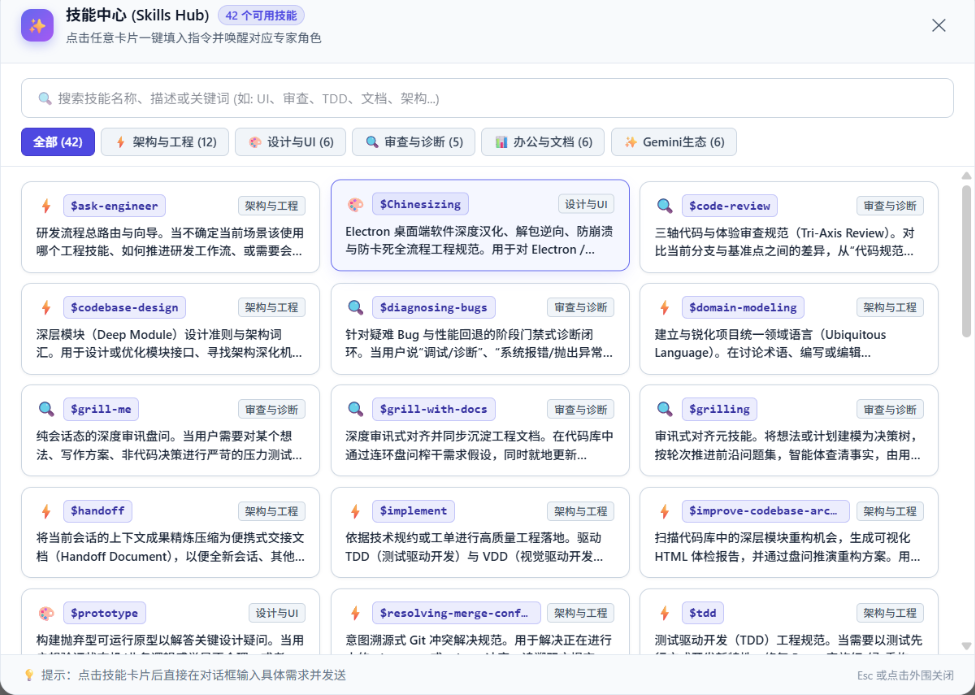
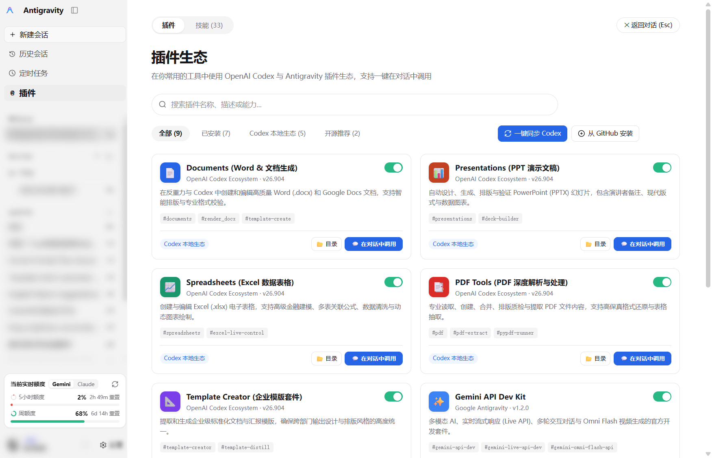
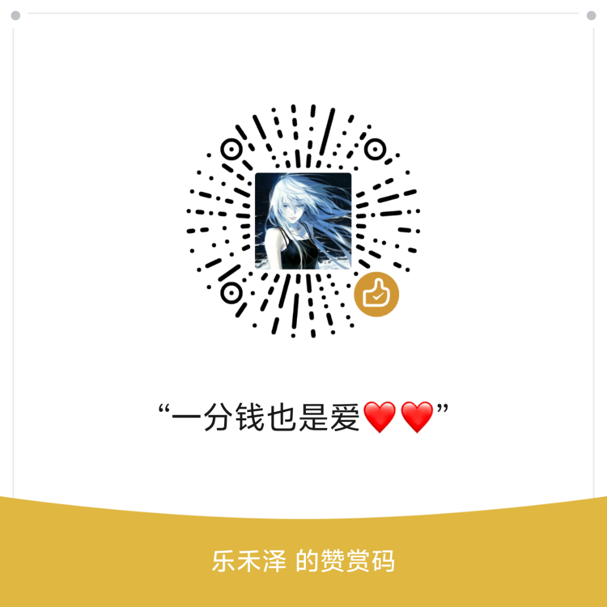

<div align="center">


# Antigravity Enhance Tools
### Native UI Localization · Real-time Context Telemetry · Thinking Depth Control · Dual-Theme GUI

**An all-in-one UI and interaction enhancement suite tailored for the official Google Antigravity desktop client.**

<p align="center">
  <a href="https://antigravity-enhance-tools.github.io/"></a>
  <a href="https://github.com/Kutaze/Antigravity-Enhance-Pack-Tools/releases"></a>
  <a href="https://afdian.com/a/Kutaze"></a>
  <a href="LICENSE"></a>
  <a href="https://github.com/Kutaze/Antigravity-Enhance-Pack-Tools"></a>
  <a href="https://github.com/Kutaze/Antigravity-Enhance-Pack-Tools"></a>
  <a href="https://github.com/Kutaze/Antigravity-Enhance-Pack-Tools"></a>
</p>

<p align="center">
  <a href="https://discord.gg/QRsPcNrSB" target="_blank" rel="noopener noreferrer">
    
  </a>
  &nbsp;&nbsp;
  <a href="https://antigravity-enhance-tools.github.io/" target="_blank" rel="noopener noreferrer">
    
  </a>
  &nbsp;&nbsp;
  <a href="https://afdian.com/a/Kutaze" target="_blank" rel="noopener noreferrer">
    
  </a>
</p>

<p align="center">
  <a href="README.md">简体中文</a> • 
  <b>English</b> • 
  <a href="README_JA.md">日本語</a>
</p>

<p align="center">
  <a href="https://antigravity-enhance-tools.github.io/">🌐 Official Website</a> • 
  <a href="#-features">Features</a> • 
  <a href="#-installation">Installation</a> • 
  <a href="#-workflow">Workflow</a> • 
  <a href="#-api-reference">API Reference</a> • 
  <a href="#-changelog">Changelog</a> • 
  <a href="#-star-history">Star History</a> • 
  <a href="https://discord.gg/QRsPcNrSB">Discord Community</a>
</p>

</div>

---

> 💬 **Community & Discussion**: Welcome to join our official Discord server at [https://discord.gg/QRsPcNrSB](https://discord.gg/QRsPcNrSB) to discuss tips, showcase workflows, and get community support.

## 🌟 Showcase

### 1. Modern Dual-Theme GUI Installer (`Antigravity Enhance Tools.exe`)
Features rounded corners, ClearType typography, intelligent directory auto-detection, and seamless one-click switching between Light and Dark themes:

| Modern Light Mode (Default) | Dark Obsidian Mode (One-Click) |
| :---: | :---: |
|  |  |

### 2. Client In-App Enhancements
Eliminates DOM oscillation loops, delivering sub-millisecond response to conversational interactions:

| Real-time Context Usage Pill & Hover Card | 4-Level Dynamic Thinking Slider |
| :---: | :---: |
|  |  |

### 3. Native Multi-Account Switcher & Bottom Bar Integration
Seamless account switching, dynamic profile pool, quota telemetry, and integrated status bar profile pill:

| Multi-Account Quota & Switcher Modal | Integrated Profile Capsule & Dynamic Tooltip |
| :---: | :---: |
|  |  |

### 4. Visual Skills Hub Showcase
Direct access button on the chat input bar opening a modern, theme-adaptive skills selector with category filters, origin badges, and one-click GitHub installation:

| Visual Skills Hub (35+ Built-in & Custom Skills, Origin Badges, and One-Click GitHub Deployment) |
| :---: |
|  |

### 5. Sidebar Plugin Ecosystem Center Showcase
Native "@ Plugins" hub in the left navigation sidebar, bridging OpenAI Codex local extensions and Antigravity native plugins:

| Sidebar Plugin Ecosystem Center (Documents, Presentations, Spreadsheets, PDF Tools, Template Creator & Gemini API Kit) |
| :---: |
|  |

---

## 🧠 Core Philosophy

### Design Philosophy & Inspiration

Throughout the architectural conception and UX design of **Antigravity Enhance Tools**, the project emphasizes lightweight zero-overhead runtime, native deep integration, and fluid developer workflows:

1. **Native Embedded Integration**: Replaces external bloated standalone tools with native status-bar integration, ensuring zero extra background processes and seamless hot-swapping.
2. **Context Transparency & Reasoning Control**: Introduces real-time token telemetry (5-tier breakdown pill) and dynamic thinking depth regulation (4-level slider) to eliminate context exhaustion anxiety.
3. **Modern Aesthetics & Zero-Jank Fluidity**: Combines rounded minimalist cards, subtle gradients, and an innovative DOM Cache Guard to guarantee silky smooth interaction without oscillation loops.
4. **Developer-Tuned Localization**: 100% full-interface localization meticulously calibrated for pair programming and agentic workflows.

> [!IMPORTANT]
> **🛡️ Security & Local Privacy Guarantee**
> - **100% Local Storage**: No remote third-party servers; zero telemetry or telemetry tracking.
> - **OS-Level Credential Isolation**: OAuth tokens, refresh tokens, and account profiles are stored **strictly inside your local operating system credential store** (Windows Credential Manager / macOS Keychain) and local private directory (`~/.gemini/account_profiles/`).
> - **Direct Google Communication**: All authentication handshakes connect directly from your machine to official Google OAuth endpoints. Logging out triggers double confirmation and securely wipes credentials from system memory.

---

## ✨ Features

### Native Full UI Localization & Real-time Context Telemetry
- **100% Coverage**: Complete translation of menu bars, workspace views, sidebar panels, input fields, and dialogs.
- **Developer-Calibrated Terminology**: Carefully tuned for LLMs, agentic workflows, and pair programming.
- **Status Bar Dynamic Capsule**: Displays exact consumed tokens and percentage (e.g. `6.4K / 250K (2.6%)`).
- **5-Tier Breakdown Card**: Expands on hover to show Cached Context, Prompt Input, Thinking Tokens, Generated Output, and Remaining Tokens.

| Localized UI · Real-time Context Breakdown Card · Quota Telemetry |
| :---: |
|  |

### Dynamic Multi-Account Switcher
- **Native Embedded Experience**: Eliminates the need for bloated standalone external tools by seamlessly embedding multi-account management directly into Antigravity's status bar.
- **Unlimited Dynamic Profiles**: Fully dynamic architecture supporting unlimited Google accounts (PRO / ULTRA / FREE) with instant search and filter tabs.
- **Instant Hot-Swapping**: One-click profile switching with automatic Access Token refresh and OS credential manager synchronization.
- **Unified Avatar Interaction**: Click the bottom-bar avatar or display name to summon the management modal; includes double-confirmation logout with clean credential removal.

| Multi-Account Quota & Switcher Modal | Integrated Profile Capsule & Dynamic Tooltip |
| :---: | :---: |
|  |  |

### 4-Level Thinking Slider
- **Embedded in Model Selector**: Seamlessly slide between `Off`, `Low`, `Medium`, and `High` reasoning modes with smooth gradient glowing effects.

| Model Selector 4-Level Dynamic Thinking Slider |
| :---: |
|  |

### Modern Dual-Theme GUI Installer
- **Single Portable Executable**: Standalone C# / WPF app without external runtimes, supporting instant Light / Dark mode switching.
- **Integrated Brand & Open Source Footer**: Built-in interactive cards displaying author info (`Kutaze`), software model (`v0.1.5 Enhance Pro`), and one-click GitHub navigation (`View Code ↗`).

| Modern Light Mode | Dark Obsidian Mode |
| :---: | :---: |
|  |  |

### Visual Skills Hub
- **Dedicated Toolbar Trigger**: Direct access button on the chat input bar opening a modern, theme-adaptive skills selector.
- **35+ Built-in & Custom Skills**: Categorized into Architecture & Engineering, Design & UI, Review & Diagnosis, Documents, Gemini Ecosystem, and a new dynamic "📦 Others" category.
- **Origin Badges**: Clear badges on each card indicating "Built-in" vs "User-Added" for instant identification.
- **One-Click GitHub Deployment**: Built-in "➕ Add Skill from GitHub" gradient button to automatically invoke a setup session from any GitHub URL.
- **One-Click Invocation**: Click any skill card to insert `$skill-name` into the chat box with automatic cursor focus.

| Visual Skills Hub (35+ Built-in & Custom Skills, Origin Badges, and One-Click GitHub Deployment) |
| :---: |
|  |

### Sidebar Plugin Ecosystem Center
- **Sidebar Integration**: Dedicated "@ Plugins" tab seamlessly mounted in the sidebar navigation alongside chats and history.
- **Dual Ecosystem Bridge**: Automatically discovers and interfaces with local OpenAI Codex plugins and native Antigravity extensions.
- **Instant Invocation**: Filter by All, Installed, Codex Local, and Open-Source Recommendations; open plugin folders, sync with Codex, or call directly into active chats.

| Sidebar Plugin Ecosystem Center (9 Core Plugins, Category Filters, and In-Chat Invocation) |
| :---: |
|  |

### Native Screenshot Integration
- **"+" Context Menu Access**: Built-in screenshot item directly inside the "+" context menu (`Win+Shift+S`).
- **Auto Clipboard Injection**: Automatically captures and injects new screenshots directly into the active prompt editor without saving to disk.

### Anti-Freeze DOM Cache Guard
- **Fingerprint Verification**: Prevents recursive DOM mutation loops and client lockups.

---

## 🚀 Installation

### 1. Windows
- Download **`Antigravity Enhance Tools.exe`** from [Releases](https://github.com/Kutaze/Antigravity-Enhance-Pack-Tools/releases).
- Run the executable, confirm path, and click **「一键安装 / 更新增强补丁」** (Install / Update Patch).

### 2. macOS & Linux
- Run the one-line terminal installer:
```bash
curl -fsSL https://raw.githubusercontent.com/Kutaze/Antigravity-Enhance-Pack-Tools/main/install.sh | bash
```

### 3. Restore Official Clean Version
- Windows: Click **「一键还原官方原版」** (Restore Official Version) in the GUI installer.
- macOS / Linux: Run `./uninstall.sh`.

---

## 📝 Changelog

### [v0.1.5] - 2026-09-23
- **Dynamic Multi-Account System (Major Overhaul vs v0.1.4)**:
  - **Native Embedded Architecture**: Completely eliminated external standalone window bloat by natively embedding quota telemetry and profile switching into Antigravity's status bar;
  - **Unlimited Dynamic Pool**: Fully overhauled profile management supporting arbitrary numbers of Google accounts (PRO / ULTRA / FREE) with instant fuzzy search, status filters, and per-profile quota meters;
  - **JWT Signature Validation & Anti-Pollution Isolation**: Injected JWT verification to ensure all OAuth tokens are physically segregated into `~/.gemini/account_profiles/<safe_email>/`, preventing cross-account token pollution during rapid switching;
  - **Two-Step Logout & Deep Credential Purge**: Added a refined logout modal with double-confirmation, followed by clean physical deletion from OS stores (Windows Credential Manager / macOS Keychain);
  - **100% Local Privacy Guarantee**: All credentials remain strictly on local disk with zero remote telemetry or middle-layer servers.
- **Bottom-Bar UX & UI Refinement (Visual Overhaul vs v0.1.4)**:
  - **Unified Profile Entrance**: Merged previously separated avatar and switch buttons into a single cohesive profile card;
  - **High-Fidelity Frosted Glass Tooltip**: Redesigned tooltip from scratch to match the modern dark frosted-glass aesthetic with smooth fade-in/out transitions;
  - **Anti-Overlap Geometry**: Optimized layout spacing between status bar capsules to prevent element squishing on narrow viewports.
- **Stability & Keybinding Hardening (Fixes vs v0.1.4)**:
  - **`Ctrl + I` Hotkey Fix**: Fixed shortcut interception issue to guarantee instant triggering of inline code composer;
  - **Runtime Freeze Prevention**: Reinforced DOM Cache Guard and concurrency re-entrance locks to prevent Electron renderer freezes during network hiccups or rapid profile switches.
- **Localization Expansion**:
  - Added **437 new UI entries** covering account management, confirmation dialogs, and model fine-tuning hints.
- **Packaging & Tooling**:
  - Upgraded standalone installer `Antigravity Enhance Tools.exe` to v0.1.5 and refreshed both offline archives (`.zip` and `.tar.gz`).

👉 **[View Full Changelog CHANGELOG.md →](CHANGELOG.md)**

<details>
<summary><b>📜 Expand Historical Releases (v0.1.0 ~ v0.1.4)</b></summary>

### [v0.1.4] - 2026-09-21
- **Skills Hub Overhaul**: Upgraded to 3-column responsive grid layout, high-contrast dark typography for both themes, auto new-chat invocation, and directory reveal.
- **Startup Zoom Safety Guard**: Cleared corrupted Chromium zoom caches and implemented strict bounds clamping against abnormal UI magnifications; added global zoom hotkeys (`Ctrl+0` / `Ctrl+=` / `Ctrl+-`) with visual toast feedback.

### [v0.1.3] - 2026-09-21
- Added full macOS (Apple Silicon M1-M4 & Intel) and Linux support with automated bash scripts.
- Runtime auto-probe reuses client built-in Electron runtime if system Node is absent.
- Standardized single-emoji title styling and multilingual documentation.

</details>

---

## 💖 Sponsorship & Support

**Antigravity Enhance Tools** is and will always remain **100% free, open-source, and privacy-respecting**.

Continuous reverse engineering, AST patching, performance tuning, and cross-platform maintenance are carried out independently by the author in spare time. If you find this project valuable, consider fueling the development via the channels below!

<div align="center">

<table>
  <tr>
    <td align="center" width="50%" valign="top">
      <br />
      
      <br /><br />
      <b>WeChat Pay (微信赞赏码)</b>
      <br />
      <sub>“一分钱也是爱 ❤️❤️ · 乐禾泽”</sub>
      <br /><br />
      <sub>Scan with WeChat app to support freely</sub>
      <br /><br />
    </td>
    <td align="center" width="50%" valign="top">
      <br />
      <a href="https://afdian.com/a/Kutaze" target="_blank" rel="noopener noreferrer">
        
      </a>
      <br /><br />
      <b>Afdian Membership / Donation</b>
      <br />
      <sub><a href="https://afdian.com/a/Kutaze">https://afdian.com/a/Kutaze</a></sub>
      <br /><br />
      <div align="left" style="display: inline-block; font-size: 13px; line-height: 1.6; color: #64748b;">
        ☕ <b>¥5/mo</b> · Coffee Support (Sponsors Wall)<br />
        ⚡ <b>¥15/mo</b> · Geek Energy (Discord Sponsor Role)<br />
        🚀 <b>¥30/mo</b> · Co-Creator (Priority Feature Requests)<br />
        👑 <b>¥99/mo</b> · Honor Guardian (Top Badge + 1v1 Support)
      </div>
      <br /><br />
    </td>
  </tr>
</table>

> 🎁 **Sponsor Perks**: Join our [Discord Server](https://discord.gg/QRsPcNrSB) and DM **Kutaze** to claim your custom Sponsor role and be listed in our official hall of fame!

</div>

---

## 📈 Star History

<div align="center">

<a href="https://star-history.com/#Kutaze/Antigravity-Enhance-Pack-Tools&Date">
 <picture>
   <source media="(prefers-color-scheme: dark)" srcset="https://api.star-history.com/svg?repos=Kutaze/Antigravity-Enhance-Pack-Tools&type=Date&theme=dark" />
   <source media="(prefers-color-scheme: light)" srcset="https://api.star-history.com/svg?repos=Kutaze/Antigravity-Enhance-Pack-Tools&type=Date" />
   
 </picture>
</a>

</div>

---

## 📜 License & Acknowledgments

Thanks to all developers who contributed their dedication and wisdom to the open-source community.

### 🤝 Special Thanks
 
This project referenced concepts and implementations from the following open-source projects during development (in no particular order):

- [lbjlaq/Antigravity-Manager](https://github.com/lbjlaq/Antigravity-Manager): Professional Antigravity Account Manager & Switcher (Antigravity Tools), which provided excellent ideas for multi-account quota monitoring and switching. Instead of requiring a standalone external application, this project natively embeds these capabilities directly into Antigravity with zero background processes.
- [renkeshui/antigravity-chinese-locale](https://github.com/renkeshui/antigravity-chinese-locale): Pioneering localization initiative for the Antigravity desktop client, providing solid reference for dictionary mapping and terminology alignment.
- [lobehub/lobe-icons](https://github.com/lobehub/lobe-icons): Popular open-source AI and developer brand vector logos and icon library, providing official standard vector GitHub brand identity support for our GUI installer.

---

- **License**: Licensed under the [MIT License](LICENSE). Retain copyright and license notices; commercial resale is strictly prohibited.
- **Security Declaration**: All account credentials and profiles are strictly encrypted and stored in your local operating system credential store (Windows Credential Manager / macOS Keychain) and local private directory; zero remote servers or telemetry.

### Disclaimer
- Google Antigravity is a trademark of Google LLC. This project is an independent community project and is not affiliated with, endorsed by, or sponsored by Google LLC.
- Please use this tool responsibly and in compliance with all relevant terms of service.
