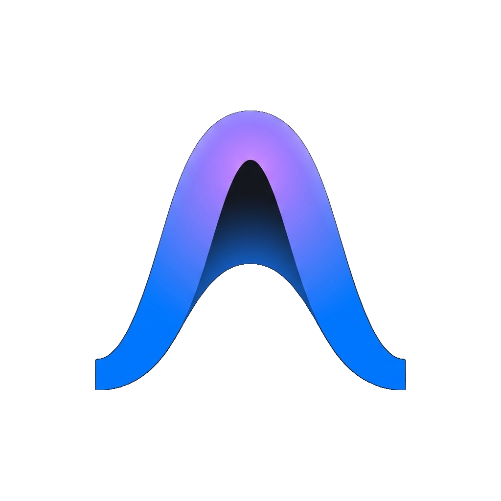
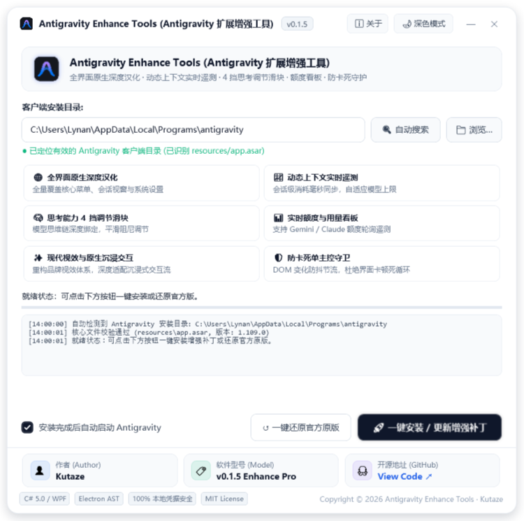
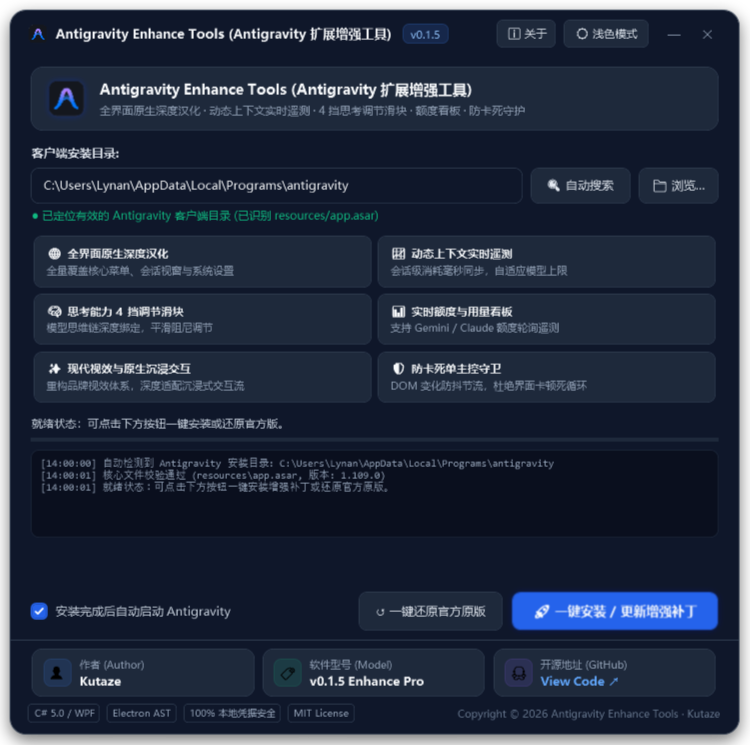
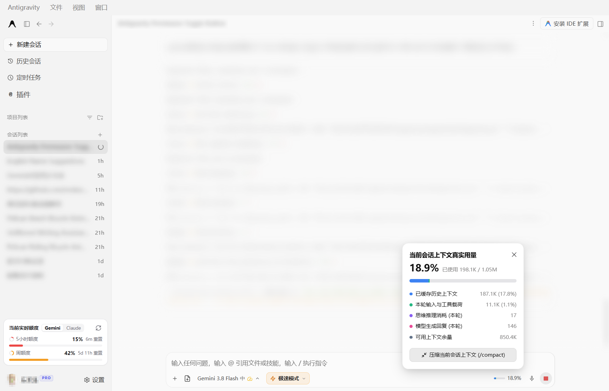
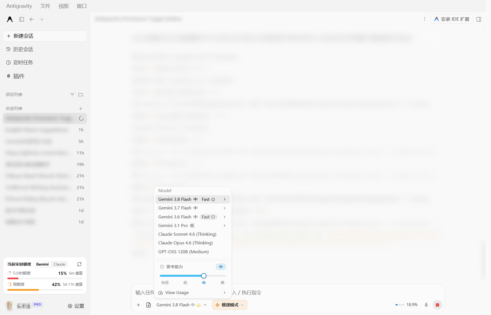
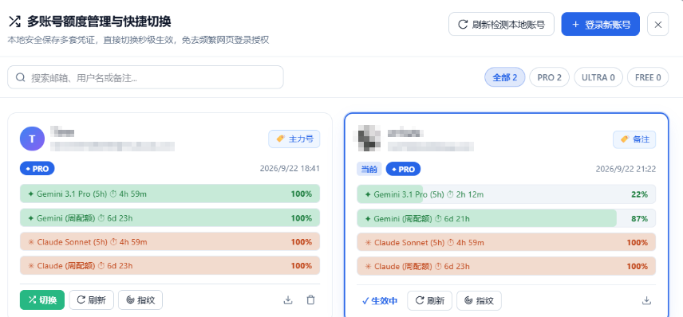
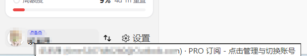

<div align="center">



# Antigravity Enhance Tools (拡張機能スイート)
### ネイティブUI多言語化 · リアルタイムコンテキスト測定 · 思考深度調整 · デュアルテーマGUI

**Google Antigravity 公式デスクトップクライアント向けに特化したUIおよび操作性拡張スイート。**

<p align="center">
  <a href="https://github.com/Kutaze/Antigravity-Enhance-Pack-Tools/releases"></a>
  <a href="LICENSE"></a>
  <a href="https://github.com/Kutaze/Antigravity-Enhance-Pack-Tools"></a>
  <a href="https://github.com/Kutaze/Antigravity-Enhance-Pack-Tools"></a>
  <a href="https://github.com/Kutaze/Antigravity-Enhance-Pack-Tools"></a>
</p>

<p align="center">
  <a href="README.md">简体中文</a> • 
  <a href="README_EN.md">English</a> • 
  <b>日本語</b>
</p>

<p align="center">
  <a href="#-機能一覧">機能一覧</a> • 
  <a href="#-インストール">インストール</a> • 
  <a href="#-ワークフロー">ワークフロー</a> • 
  <a href="#-api-リファレンス">API リファレンス</a> • 
  <a href="#-更新履歴">更新履歴</a>
</p>

</div>

---

## 🌟 プレビュー (Showcase)

### 1. モダンデュアルテーマ GUI インストーラー (`Antigravity Enhance Tools.exe`)
丸角カードレイアウト、高精細 ClearType レンダリング、ディレクトリ自動検出エンジンを搭載し、右上ボタンで「ライト」と「ダーク」テーマを瞬時に切り替え可能：

| ライトモード (デフォルト) | ダークモード (ワンクリック切替) |
| :---: | :---: |
|  |  |

### 2. クライアント内部拡張機能
DOM監視のループ振動を防止し、会話インタラクションにミリ秒単位でスムーズに応答：

| リアルタイムコンテキストカプセル & 詳細ホバーカード | 4段階思考深度 (Thinking) スライダー |
| :---: | :---: |
|  |  |

### 3. マルチアカウント管理 & ステータスバー統合
アカウントプールのシームレス切替、リアルタイム枠（Quota）テレメトリ、統合プロファイルカプセルを搭載：

| マルチアカウント管理 & ワンクリック切替モーダル | ステータスバー統合プロファイル & ツールチップ |
| :---: | :---: |
|  |  |

---

## 🧠 設計思想

### 開発方針とインスピレーション (Design Philosophy & Inspiration)

本プロジェクトは、業界の先進的AIツールおよびオープンソースコミュニティの成果から深く学び構築されています：

1. **[lbjlaq/Antigravity-Manager](https://github.com/lbjlaq/Antigravity-Manager) の思想吸収とネイティブ内蔵化**: オープンソースプロジェクト [lbjlaq/Antigravity-Manager](https://github.com/lbjlaq/Antigravity-Manager)（Antigravity 账号管理与切换工具）のアカウント管理や枠監視の着想を深く参考にしつつ、独立した外部アプリを別途起動する煩わしさとメモリ消費を排除するため、全機能を Antigravity クライアント内部へネイティブ統合。
2. **Codex に学ぶ直感的なインタラクション**: トークン使用量をステータスバーカプセル（5段階カード）でリアルタイム可視化し、思考スライダーで推論深度を即座に調整。
3. **Workbuddy に学ぶモダンなUI/UX**: 洗練された丸角デザインと独自の DOM キャッシュガード（Cache Guard）により、画面のちらつきやフリーズを根絶。
4. **オープンソースへのリスペクト**: 先駆的オープンソースプロジェクト [renkeshui/antigravity-chinese-locale](https://github.com/renkeshui/antigravity-chinese-locale) の知見を深く参考にさせていただきました。

> [!IMPORTANT]
> **🛡️ アカウントセキュリティとローカルプライバシー保護宣言**
> - **100% ローカル保存・外部送信ゼロ**: 外部サーバーは一切使用せず、データの第三者収集や通信は行いません。
> - **OS水準の認証情報隔離**: アカウントのOAuthトークンや更新トークンは、すべてローカルOSのセキュアな認証情報マネージャー（Windows Credential Manager / macOS Keychain）および専用フォルダ（`~/.gemini/account_profiles/`）にのみ安全に保管されます。
> - **公式直接通信と完全自律**: 認証およびトークン更新は端末から直接 Google 公式エンドポイントと行われます。ログアウト時の二次確認と端末内完全消去に対応。

---

## ✨ 機能一覧

### ネイティブ全画面多言語化 & リアルタイムコンテキスト測定
- **UI全域をカバー**: メニューバー、サイドパネル、対話入力欄、設定画面などを自然に多言語化。
- **専門用語の精緻な調整**: AIプログラミングやAgent共同作業に即した自然な専門用語調整。
- **ステータスバー常駐カプセル**: トークン消費量と残量を動的表示（例: `6.4K / 250K (2.6%)`）。
- **5層詳細ポップアップ**: キャッシュ済み、入力負荷、推論思考、生成出力の5層をポップアップで瞬時に確認。

| 多言語化UI · リアルタイムコンテキスト詳細カード · 枠（Quota）テレメトリ |
| :---: |
|  |

### 動的マルチアカウント即時切り替え (Multi-Account Switcher)
- **ネイティブ内蔵化デザイン**: 肥大化した外部ツールを別途起動する必要なく、底面ステータスバーから直接切り替えと残量枠確認が可能。
- **無制限動的プロファイル**: Google アカウント（PRO / ULTRA / FREE）を制限なく登録・管理・検索可能。
- **ワンクリック即時切替**: Access Token の自動リフレッシュと OS 認証情報ストアの同期により、アカウント混線を徹底防止。
- **アバター統合インタラクション**: アバターまたはユーザー名クリックで管理画面を展開。二段階確認付きログアウトと認証情報の完全削除をサポート。

| マルチアカウント管理 & 即時切替モーダル (プライバシー保護加工済み) | ステータスバー統合プロファイル & ツールチップ |
| :---: | :---: |
|  |  |

### 4段階思考深度スライダー (Thinking Slider)
- **モデル選択ポップアップに直結**: 「OFF / 低 / 中 / 高」の調整スライダーを配置し、最高深度ではグラデーション発光エフェクトが有効化。

| モデル選択 4段階思考深度調整スライダー |
| :---: |
|  |

### モダンデュアルテーマ GUI インストーラー
- **独立単一バイナリ**: 外部ランタイム不要な C# / WPF ネイティブアプリ。右上ボタンで「ライト」と「ダーク」テーマを瞬時に切り替え可能。
- **統合フッター情報**: 作者名（`Kutaze`）、ソフトウェアモデル（`v0.1.5 Enhance Pro`）、GitHubリポジトリ（`View Code ↗`）を直感的に配置。

| ライトモード (統合フッター付き) | ダークモード (ワンクリック切替) |
| :---: | :---: |
|  |  |

### 視覚的スキルハブ (Skills Hub)
- **チャットツールバー常駐**: 専用アイコンから、美しいモーダルでスキル一覧をブラウズ。
- **35以上の厳選スキル**: アーキテクチャ、UI設計、レビュー、オフィス文書、Geminiエコシステムなどをリアルタイム検索。
- **ワンクリック呼び出し**: カードをクリックするだけで `$skill-name` を対話欄に自動入力し、カーソルを即座にフォーカス。

### コンテキストメニュー連携スクリーンショット
- **「+」メニュー連携**: 入力欄左側の「+」メニュー内に「スクリーンショット (Win+Shift+S)」をネイティブ配置。
- **クリップボード自動検知**: 撮影完了後、画像を自動検知して対話欄へシームレスに挿入。

### フリーズ防止 DOM キャッシュガード
- **ノードハッシュ検証**: 不要な再描画と無限ループを遮断。

---

## 🚀 インストール

### 1. Windows 環境
1. [Releases ページ](https://github.com/Kutaze/Antigravity-Enhance-Pack-Tools/releases) から最新の **`Antigravity Enhance Tools.exe`** をダウンロード。
2. 実行し、パスを確認後 **「一键安装 / 更新增强补丁」** (インストール/更新) をクリック。

### 2. macOS & Linux 環境
ターミナルを開き、以下のコマンドを実行するだけで自動セットアップが完了します：
```bash
curl -fsSL https://raw.githubusercontent.com/Kutaze/Antigravity-Enhance-Pack-Tools/main/install.sh | bash
```

### 3. 公式オリジナル版への復元
- **Windows**: GUIインストーラーで **「一键还原官方原版」** をクリック。
- **macOS / Linux**: `./uninstall.sh` を実行。

---

## 📝 更新履歴

### [v0.1.5] - 2026-09-23
- **動的マルチアカウント管理システム（v0.1.4 からの大規模再設計）**:
  - **ネイティブ内蔵アーキテクチャ**: 外部独立アプリ起動の煩雑さを解消し、ステータスバーから直接アカウント切り替えと残量枠確認が可能に。追加の常駐プロセスはゼロ。
  - **無制限動的プロファイルプール**: 静的バインドを全廃。無制限の Google アカウント（PRO / ULTRA / FREE）追加、リアルタイム検索、分類フィルター、独立枠メーター表示をサポート。
  - **JWT 署名検証と物理的隔離**: 認証情報注入ロジックを刷新し、JWT 検証による個別フォルダ（`~/.gemini/account_profiles/<safe_email>/`）への厳格な隔離を導入。高速切り替え時の混線・汚染を完全防止。
  - **二段階確認付きログアウトと完全削除**: アカウント管理画面に二段階確認付きログアウトを新設。OS 認証ストア（Windows Credential Manager / Keychain）から完全に物理削除。
  - **100% ローカルプライバシー保護**: すべての認証データはローカルにのみ保存され、外部中継サーバーは一切存在しません。
- **底面ステータスバー UI・操作性全面刷新（v0.1.4 比の視覚・レイアウト強化）**:
  - **アバターと切替導線の統合**: 分離していたアバターと切替ボタンを一体化カードに統合。クリックひとつで管理画面を展開。
  - **高品質すりガラス調ツールチップ**: 旧来の簡易吹き出しを一新し、モダンなダークすりガラス調デザインと滑らかなフェードイン／アウトを実装。
  - **要素干渉・圧迫防止レイアウト**: カプセル間の幾何学的マージンを調整し、狭小画面での重なりや崩れを解消。
- **ショートカットと安定性の強化（v0.1.4 比のバグ修正・保護機構）**:
  - **`Ctrl + I` ショートカットの修復**: キーボードイベント競合を解消し、インラインコード編集（Composer）の確実な起動を保証。
  - **フリーズ防止の二重化**: DOM キャッシュガード（Cache Guard）とリエントラントロックを強化し、過度な操作やネットワーク遅延によるクラッシュ・無応答を防止。
- **UI 多言語化の更なる拡充**:
  - アカウント管理モーダル、設定項目、確認ダイアログを中心に **437 件** の翻訳データを追加。
- **インストーラー・配布パッケージ**:
  - `Antigravity Enhance Tools.exe` を v0.1.5 へ刷新し、配布用アーカイブ（`.zip` / `.tar.gz`）を最新化。

👉 **[詳細な更新履歴 CHANGELOG.md を見る →](CHANGELOG.md)**

<details>
<summary><b>📜 過去バージョンの更新履歴を展開 (v0.1.0 〜 v0.1.4)</b></summary>

### [v0.1.4] - 2026-09-21
- **スキルハブ（Skills Hub）の刷新**：3列レスポンシブグリッドレイアウトへの全面改修、ダーク・ライト両テーマにおける高コントラストなテキスト表示、新規チャット自動遷移呼び出し、仕様フォルダ展開機能。
- **起動時ズーム異常の安全ガード**：破損したChromiumキャッシュを自動クリアし、異常なUI拡大を防止するガードを実装。グローバルズームショートカット（`Ctrl+0` / `Ctrl+=` / `Ctrl+-`）とリアルタイムトースト通知を追加。

### [v0.1.3] - 2026-09-21
- macOS（Apple Silicon M1〜M4 および Intel）と各主要 Linux ディストリビューションに対応。
- 独立 Node.js が未検出の場合、クライアント内蔵 Electron 実行環境を自動活用するインテリジェント機構を実装。
- 多言語ドキュメント（簡体字中国語・英語・日本語）の追加とナビゲーションの最適化。

</details>

---

## 📜 ライセンスと免責事項

- 本プロジェクトは [MIT License](LICENSE) のもとで公開されています。
- [renkeshui/antigravity-chinese-locale](https://github.com/renkeshui/antigravity-chinese-locale) プロジェクトに心より感謝申し上げます。
- オープンソースプロジェクト [lbjlaq/Antigravity-Manager](https://github.com/lbjlaq/Antigravity-Manager)（Antigravity 账号管理与切换工具）のアカウント枠管理およびツール統合の先駆的着想に深く感謝申し上げます。
- Google Antigravity は Google LLC の商標です。本プロジェクトは独立したコミュニティによるオープンソースソフトウェアです。
