<div align="center">

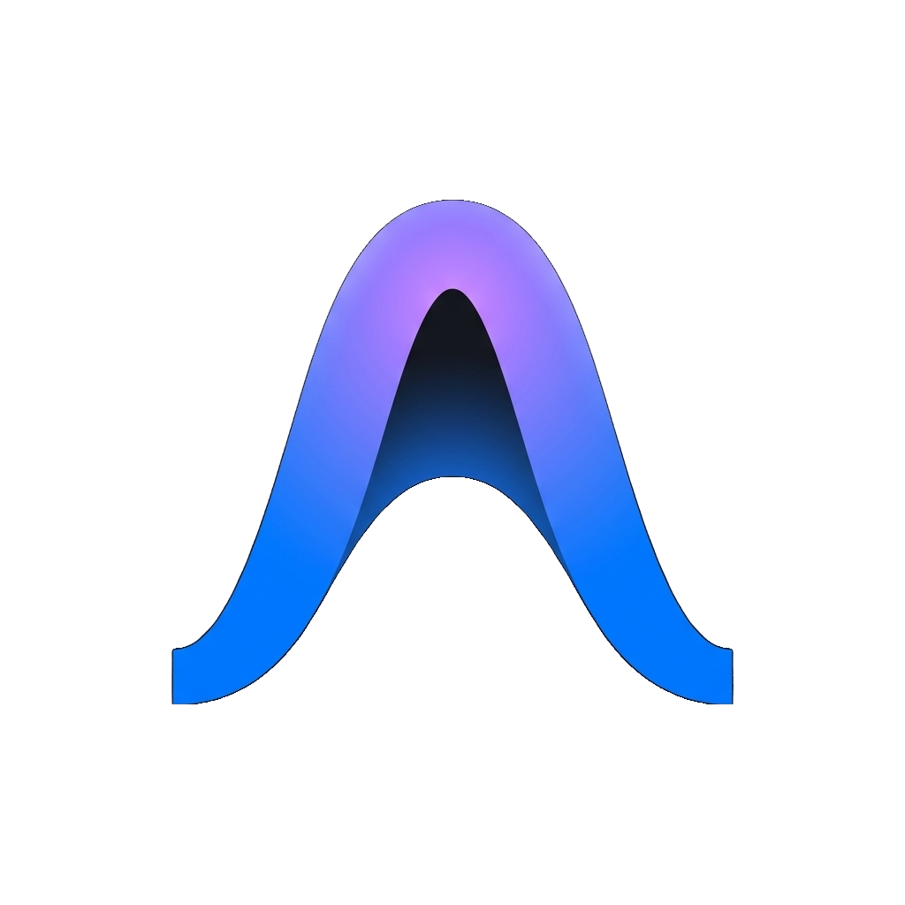

# Antigravity Enhance Tools (拡張機能スイート)
### ネイティブUI多言語化 · リアルタイムコンテキスト測定 · 思考深度調整 · デュアルテーマGUI

**Google Antigravity 公式デスクトップクライアント向けに特化したUIおよび操作性拡張スイート。**

<p align="center">
  <a href="https://antigravity-enhance-tools.github.io/"></a>
  <a href="https://github.com/Kutaze/Antigravity-Enhance-Pack-Tools/releases"></a>
  <a href="LICENSE"></a>
  <a href="https://github.com/Kutaze/Antigravity-Enhance-Pack-Tools"></a>
  <a href="https://github.com/Kutaze/Antigravity-Enhance-Pack-Tools"></a>
  <a href="https://github.com/Kutaze/Antigravity-Enhance-Pack-Tools"></a>
</p>

<p align="center">
  <a href="https://discord.gg/QRsPcNrSB" target="_blank" rel="noopener noreferrer">
    
  </a>
  &nbsp;&nbsp;
  <a href="https://antigravity-enhance-tools.github.io/" target="_blank" rel="noopener noreferrer">
    
  </a>
</p>

<p align="center">
  <a href="README.md">简体中文</a> • 
  <a href="README_EN.md">English</a> • 
  <b>日本語</b>
</p>

<p align="center">
  <a href="https://antigravity-enhance-tools.github.io/">🌐 公式サイト</a> • 
  <a href="#-機能一覧">機能一覧</a> • 
  <a href="#-インストール">インストール</a> • 
  <a href="#-ワークフロー">ワークフロー</a> • 
  <a href="#-api-リファレンス">API リファレンス</a> • 
  <a href="#-更新履歴">更新履歴</a> • 
  <a href="#-star-history">Star History</a> • 
  <a href="https://discord.gg/QRsPcNrSB">Discord コミュニティ</a>
</p>

</div>

---

> 💬 **公式コミュニティ & サポート**: Discord 交流チャンネル [https://discord.gg/QRsPcNrSB](https://discord.gg/QRsPcNrSB) にぜひご参加ください！開発者同士の活用ノウハウ共有や機能提案、フィードバックを受け付けています。

## 🌟 プレビュー (Showcase)

### 1. モダンデュアルテーマ GUI インストーラー (`Antigravity Enhance Tools.exe`)
丸角カードレイアウト、高精細 ClearType レンダリング、ディレクトリ自動検出エンジンを搭載し、右上ボタンで「ライト」と「ダーク」テーマを瞬時に切り替え可能：

| ライトモード (デフォルト) | ダークモード (ワンクリック切替) |
| :---: | :---: |
| 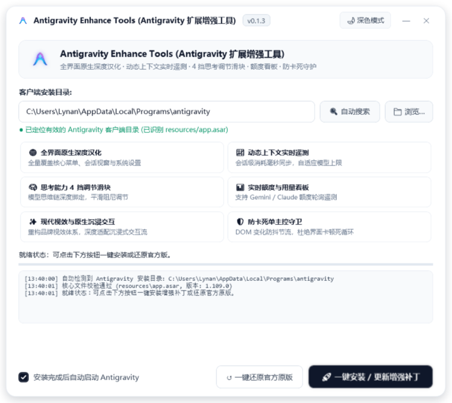 | 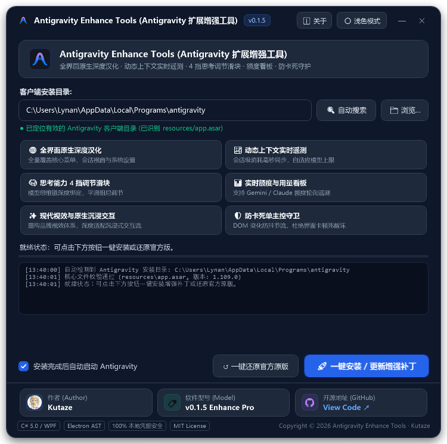 |

### 2. クライアント内部拡張機能
DOM監視のループ振動を防止し、会話インタラクションにミリ秒単位でスムーズに応答：

| リアルタイムコンテキストカプセル & 詳細ホバーカード | 4段階思考深度 (Thinking) スライダー |
| :---: | :---: |
| 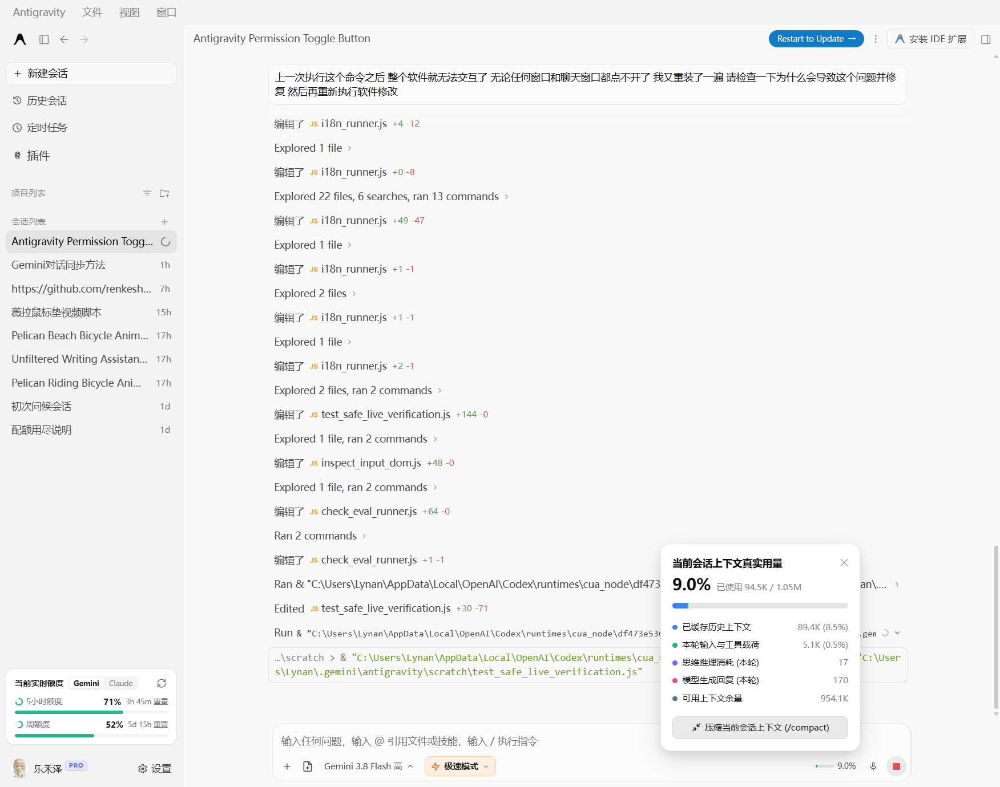 | 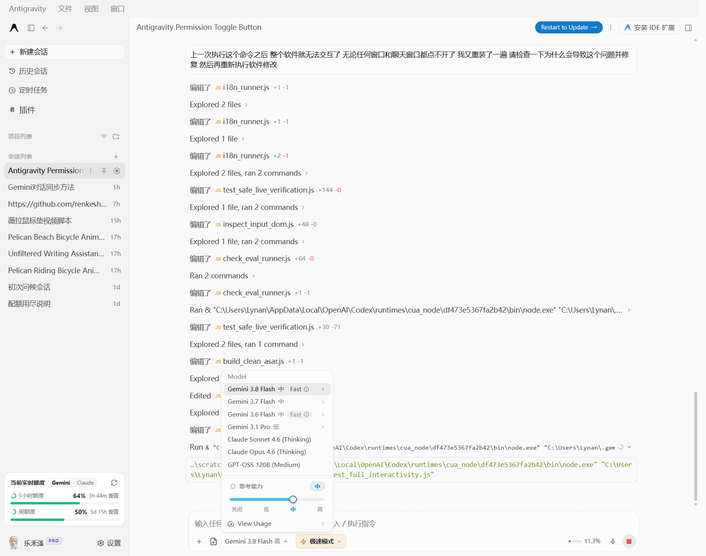 |

### 3. マルチアカウント管理 & ステータスバー統合
アカウントプールのシームレス切替、リアルタイム枠（Quota）テレメトリ、統合プロファイルカプセルを搭載：

| マルチアカウント管理 & ワンクリック切替モーダル | ステータスバー統合プロファイル & ツールチップ |
| :---: | :---: |
| 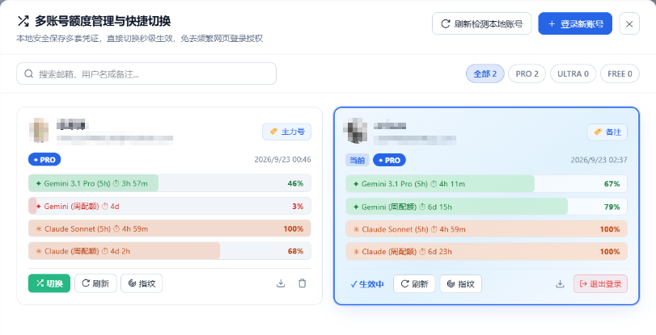 | 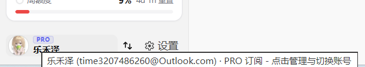 |

### 4. 視覚的スキルハブ (Skills Hub) 実機キャプチャ
チャットツールバーからワンクリックで展開し、35種類以上の設計・開発スキルを検索・呼び出し。新カテゴリ「📦 その他」やネイティブ/カスタム識別バッジ、GitHub ワンクリック追加に対応：

| 視覚的スキルハブ (35種類以上の厳選スキル、所属バッジ、GitHub ワンクリック追加) |
| :---: |
| 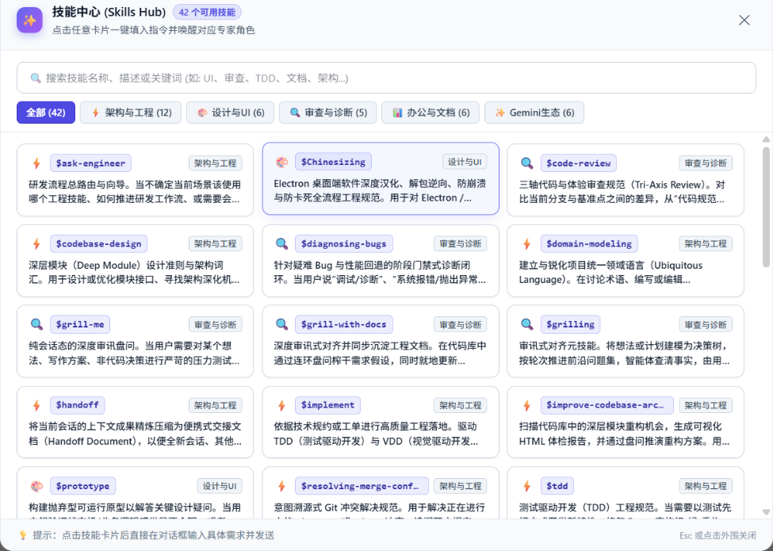 |

### 5. サイドバープラグインエコシステムセンター (Plugin Center) 実機キャプチャ
左側サイドバーに「@ プラグイン」ハブをネイティブ配置。OpenAI Codex ローカル拡張機能と Antigravity プラグインを統合管理（対話欄ワンクリック呼び出し対応）：

| サイドバープラグインセンター (Documents / Presentations / Spreadsheets / PDF Tools など 9 種類の主要プラグイン) |
| :---: |
| 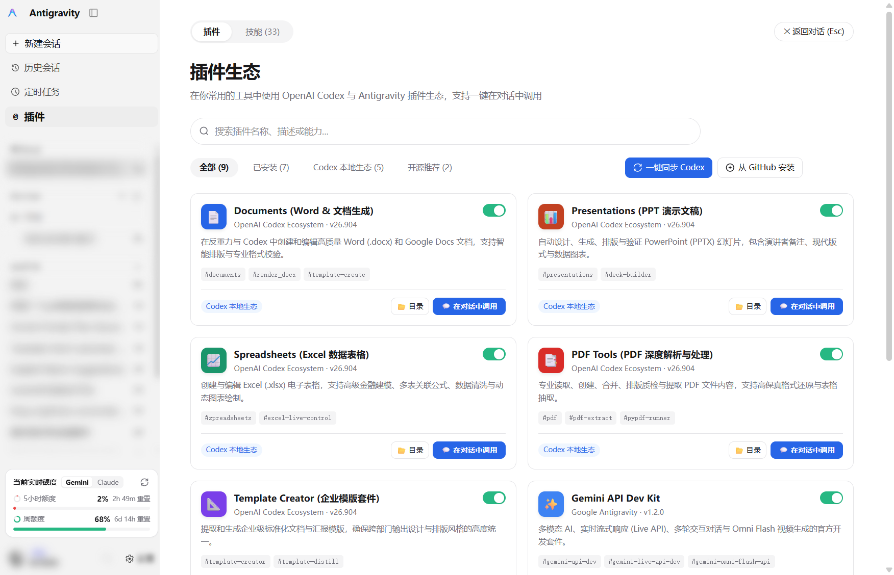 |

### 6. タイムライン進捗バー & ターン即時検索モーダル [v0.1.6 核心機能]
超長大セッションでの「スクロールバー操作の煩雑さ」「過去ターンの特定困難」「仮想 DOM による過去発言消失」の 3 大課題を完全解消：

1. **タイムライン進捗バー (実機測定 · 画像3)**:
   - ウィンドウの約 80% をカバーする垂直マイルストーン目盛り。18〜65 段階のダイナミックサンプリング；
   - スクロールとホバーに連動した 60/120fps の流体コサイン拡大波形。現在位置をポインタがリアルタイム表示；
   - 軌道の最下部にターン即時検索ボタン `≡` を常駐。
2. **会話ターン即時検索 & 直行モーダル (実機測定 · 画像2)**:
   - 画面左の `≡` ボタンをクリックして即座にフローティング検索窓を展開；
   - ターン番号や質問キーワードでミリ秒レベルのリアルタイム絞り込み検索が可能；
   - 現在のターンが鮮やかなエメラルドグリーン (`#10b981`) でハイライト；
   - ワンクリックで対象ターンへスムーズ直行。**850ms 片方向抑制ロック**により、往復振動・画面ブレを根絶。
3. **すりガラス履歴スナップショットカード (`agy-historical-viewer`)**:
   - 仮想スクロールによってアンマウントされた過去のターンでも、自動で端部にスクロールしすりガラス調カードを展開；
   - ローカルディスクログを直接読み込み、ユーザーの質問と AI の回答要約を 100% 復元。ワンクリック個別コピーに対応。

| タイムライン進捗バー (実機切り抜き) | 会話ターン即時検索モーダル (実機測定 · プライバシーマスキング済) |
| :---: | :---: |
| 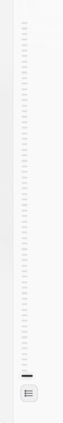 | 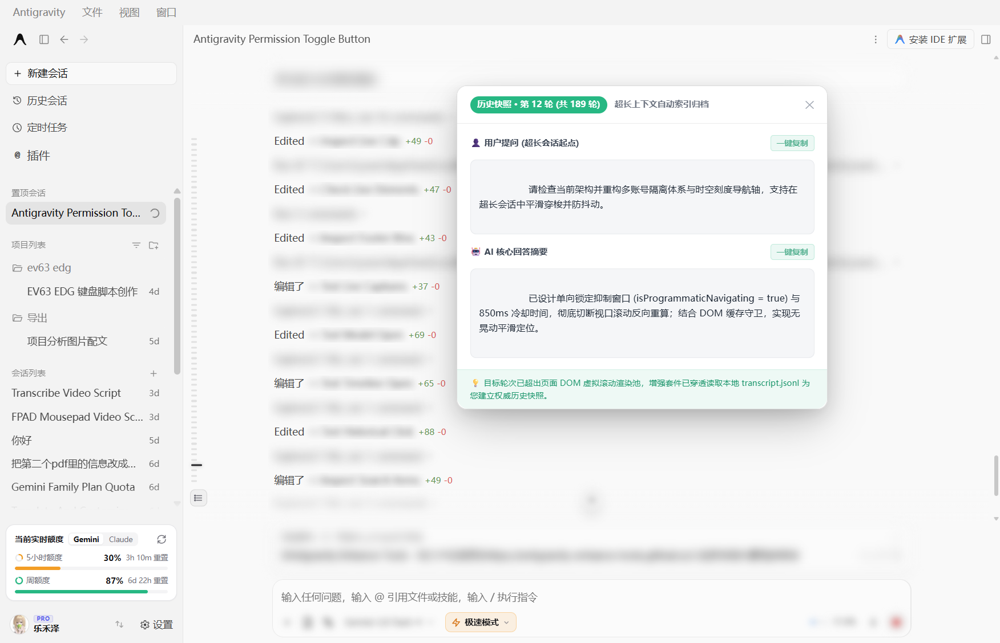 |

| すりガラス履歴スナップショットカード (`agy-historical-viewer` 実機測定 · 100% 完全ローカル) |
| :---: |
| 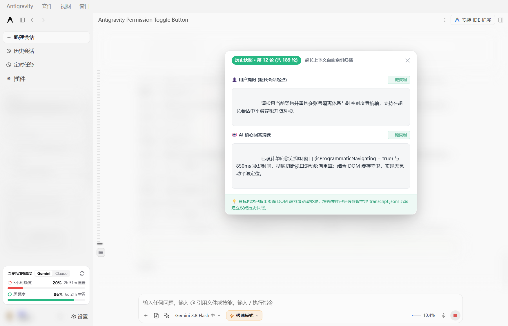 |

### 7. モデル推論思考の動的適応アーキテクチャ & 端末ログ直接インデックス [v0.1.6 新機能]
モデル能力判定パイプラインを新設。Gemini 専用の 4 段階思考スライダー（0k/8k/16k/24k）、Claude 向けの「内蔵思考（固定）」アンバーゴールドバッジ、GPT の「固定推論（中）」を完全分離。メインプロセス IPC 経由でローカル `transcript.jsonl` を直接読み込み、要約ノイズを完全除去した純粋な会話検索インデックスを実現：

| モデル思考適応アーキテクチャ · クラッシュ防止ゲート · ローカルログ直接インデックス実機実測 (プライバシー保護済) |
| :---: |
| 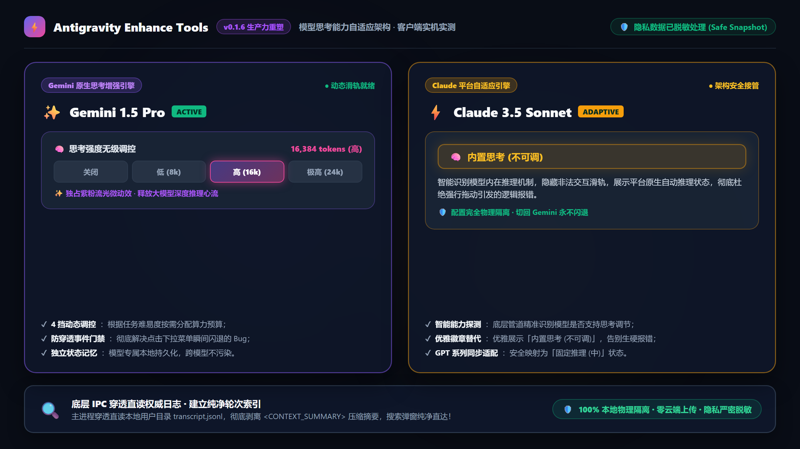 |

---

## 🧠 設計思想

### 開発方針とインスピレーション (Design Philosophy & Inspiration)

**Antigravity Enhance Tools** のアーキテクチャおよびUX設計は、徹底した軽量性、クライアントへのネイティブ統合、そして滑らかな開発体験を追求しています：

1. **ネイティブ統合アーキテクチャ**: 外部独立アプリ常駐の煩わしさとメモリ負荷を排除し、ステータスバーから直接アカウント切り替えと残量枠確認が可能に。常駐プロセスはゼロ。
2. **コンテキストの透明化と思考深度制御**: トークン使用量をステータスバーカプセル（5段階カード）でリアルタイム可視化し、思考スライダーで推論深度を即座に調整。
3. **モダンな美学とフリーズ防止**: 洗練された丸角デザインと独自の DOM キャッシュガード（Cache Guard）により、画面のちらつきやフリーズを根絶。
4. **自然な専門用語調整**: AIプログラミングやAgent共同作業に即した自然な専門用語調整を全域で実現。

> [!IMPORTANT]
> **🛡️ アカウントセキュリティとローカルプライバシー保護宣言**
> - **100% ローカル保存・外部送信ゼロ**: 外部サーバーは一切使用せず、データの第三者収集や通信は行いません。
> - **OS水準の認証情報隔離**: アカウントのOAuthトークンや更新トークンは、すべてローカルOSのセキュアな認証情報マネージャー（Windows Credential Manager / macOS Keychain）および専用フォルダ（`~/.gemini/account_profiles/`）にのみ安全に保管されます。
> - **公式直接通信と完全自律**: 認証およびトークン更新は端末から直接 Google 公式エンドポイントと行われます。ログアウト時の二次確認と端末内完全消去に対応。

---

## ✨ 機能一覧

### ネイティブ全画面多言語化 & リアルタイムコンテキスト測定
- **UI全域をカバー**: メニューバー、サイドパネル、対話入力欄、設定画面などを自然に多言語化。
- **専門用語の精緻な調整**: AIプログラミングやAgent共同作業に即した自然な専門用語調整。
- **ステータスバー常駐カプセル**: トークン消費量と残量を動的表示（例: `6.4K / 250K (2.6%)`）。
- **5層詳細ポップアップ**: キャッシュ済み、入力負荷、推論思考、生成出力の5層をポップアップで瞬時に確認。

| 多言語化UI · リアルタイムコンテキスト詳細カード · 枠（Quota）テレメトリ |
| :---: |
|  |

### 動的マルチアカウント即時切り替え (Multi-Account Switcher)
- **ネイティブ内蔵化デザイン**: 肥大化した外部ツールを別途起動する必要なく、底面ステータスバーから直接切り替えと残量枠確認が可能。
- **無制限動的プロファイル**: Google アカウント（PRO / ULTRA / FREE）を制限なく登録・管理・検索可能。
- **ワンクリック即時切替**: Access Token の自動リフレッシュと OS 認証情報ストアの同期により、アカウント混線を徹底防止。
- **アバター統合インタラクション**: アバターまたはユーザー名クリックで管理画面を展開。二段階確認付きログアウトと認証情報の完全削除をサポート。

| マルチアカウント管理 & 即時切替モーダル | ステータスバー統合プロファイル & ツールチップ |
| :---: | :---: |
|  |  |

### 4段階思考深度スライダー (Thinking Slider)
- **モデル選択ポップアップに直結**: 「OFF / 低 / 中 / 高」の調整スライダーを配置し、最高深度ではグラデーション発光エフェクトが有効化。

| モデル選択 4段階思考深度調整スライダー |
| :---: |
|  |

### モダンデュアルテーマ GUI インストーラー
- **独立単一バイナリ**: 外部ランタイム不要な C# / WPF ネイティブアプリ。右上ボタンで「ライト」と「ダーク」テーマを瞬時に切り替え可能。
- **統合フッター情報**: 作者名（`Kutaze`）、ソフトウェアモデル（`v0.1.5 Enhance Pro`）、GitHubリポジトリ（`View Code ↗`）を直感的に配置。

| ライトモード (統合フッター付き) | ダークモード (ワンクリック切替) |
| :---: | :---: |
|  |  |

### 視覚的スキルハブ (Skills Hub)
- **チャットツールバー常駐**: 専用アイコンから、美しいモーダルでスキル一覧をブラウズ。
- **35種類以上の厳選スキルと全カテゴリ**: アーキテクチャ、UI設計、レビュー、オフィス文書、Geminiエコシステムに加え、動的適応「📦 その他」カテゴリを新設。
- **2重の所属識別バッジ**: 各カードに「ネイティブ (青)」と「ユーザー追加 (緑)」バッジを明示し、出自を瞬時に判別。
- **GitHub スキルワンクリック導入**: 最下部に「➕ GitHub からスキルを追加」ボタンを新設。リポジトリURLを渡すだけでAIがインストールセッションを自動開始。
- **ワンクリック呼び出し**: カードをクリックするだけで `$skill-name` を対話欄に自動入力し、カーソルを即座にフォーカス。

| 視覚的スキルハブ (35種類以上の厳選エコシステムスキルを即座に検索) |
| :---: |
|  |

### サイドバープラグインエコシステムセンター
- **サイドバーネイティブ統合**: 左側ナビゲーションバーに「@ プラグイン」を常駐配置。
- **Codex & Antigravity デュアル互換**: ローカルの OpenAI Codex プラグイン群と Antigravity 拡張機能を自動検出・統括管理。
- **即時呼び出しと柔軟なフィルタ**: すべて、インストール済み、Codex ローカル、オープンソース推薦の4区分でフィルタリング。ディレクトリ展開や対話欄への直接呼び出しに対応。

| サイドバープラグインセンター (9種類の主要プラグイン、分類フィルタと対話欄呼び出し) |
| :---: |
|  |

### タイムライン目盛りナビゲーション & 履歴スナップショット (`agy-historical-viewer`) [v0.1.6 核心機能]
- **3倍垂直拡大タイムライン軸**: 最大高さをウィンドウ高の約80%まで拡張し、18〜65段階のマイルストーンを動的サンプリング。カーソル移動に応じてコサイン波による 60/120fps の滑らかな流体拡大を実現。
- **850ms 反動防止プログラムロック**: 目盛りクリックや検索結果遷移時に `isProgrammaticNavigating = true` 冷却ロックを発動し、スクロール再計算による激しい振動ループを完全遮断。
- **すりガラス調履歴スナップショットカード (`agy-historical-viewer`)**: DOM 仮想リストでアンマウントされた過去の会話ノードへ遷移する際、自動で視界端へスクロールし、すりガラス調のプレビューカードを展開。ユーザーの質問とAIの回答を完全閲覧・ワンクリックコピー可能。
- **発話ノードの翡翠グリーンパルス検知**: TreeWalker によるテキスト照合で目的の発話バブルを特定し、`#10b981` 翡翠グリーンの二重パルス発光で視認性を確保。

| タイムライン目盛りナビ · エメラルドパルス発光 · すりガラス履歴スナップショットカード (機密情報マスキング済) |
| :---: |
|  |

### モデル推論思考の動的適応アーキテクチャ & 端末ログ直接インデックス [v0.1.6 核心機能]
- **モデル推論能力適応パイプライン (`getModelThinkingCapabilities`)**:
  - **Gemini シリーズ**: 4 段階動的スライダー（オフ / 8k / 16k / 24k）を独占提供。
  - **Claude シリーズ**: プラットフォーム組み込み推論を識別し、「内蔵思考（固定）」アンバーゴールドバッジとして安全に置換。不正なクリックエミュレートや設定汚染を防止。
  - **GPT シリーズ**: 「固定推論（中）」エメラルドグリーンバッジへ安全にマッピング。
- **メニュー展開クラッシュ防止ゲート**: ポップオーバー展開時の不正な模擬クリックを遮断し、`stopPropagation` によるイベントバリアを実装。モデル選択メニューが即座に安定して開くように改修。
- **端末ログ直接インデックス (`transcript.jsonl`)**: メインプロセスに `antigravity:get-conversation-turns` IPC を追加。ローカル保存の会話ログを直接読み込み、正規表現で `<CONTEXT_SUMMARY>` 要約ノイズを完全除去し、重複表示を根絶。

| モデル思考適応アーキテクチャ · クラッシュ防止ゲート · ローカルログ直接インデックス実機実測 (プライバシー保護済) |
| :---: |
|  |

### コンテキストメニュー連携スクリーンショット
- **「+」メニュー連携**: 入力欄左側の「+」メニュー内に「スクリーンショット (Win+Shift+S)」をネイティブ配置。
- **クリップボード自動検知**: 撮影完了後、画像を自動検知して対話欄へシームレスに挿入。

### フリーズ防止 DOM キャッシュガード
- **ノードハッシュ検証**: 不要な再描画と無限ループを遮断。

---

## 🚀 インストール

### 1. Windows 環境
1. [Releases ページ](https://github.com/Kutaze/Antigravity-Enhance-Pack-Tools/releases) から最新の **`Antigravity Enhance Tools.exe`** をダウンロード。
2. 実行し、パスを確認後 **「一键安装 / 更新增强补丁」** (インストール/更新) をクリック。

### 2. macOS & Linux 環境
ターミナルを開き、以下のコマンドを実行するだけで自動セットアップが完了します：
```bash
curl -fsSL https://raw.githubusercontent.com/Kutaze/Antigravity-Enhance-Pack-Tools/main/install.sh | bash
```

### 3. 公式オリジナル版への復元
- **Windows**: GUIインストーラーで **「一键还原官方原版」** をクリック。
- **macOS / Linux**: `./uninstall.sh` を実行。

---

## 📝 更新履歴

### [v0.1.6] - 2026-09-27 安定性強化・体験刷新版
- **サイドバー長大コンテキスト振動防止ガード**: `isProgrammaticNavigating` 状態機と 850ms 冷却ロックを導入し、タイムライン移動時の画面激震と無限ループを根絶；
- **すりガラス履歴スナップショットカード (`agy-historical-viewer`)**: DOM 仮想リスト範囲外の過去ログも自動でフローティングカード展開し、アンマウントされた履歴の閲覧・コピーに対応；
- **端末ログ直接インデックス (Local Disk Transcript Indexing)**: メインプロセス IPC `antigravity:get-conversation-turns` を新設し、`transcript.jsonl` を直接読み込んで `<CONTEXT_SUMMARY>` 要約ノイズを除去、検索重複を解消；
- **モデル切替メニューの即時展開・クラッシュ根絶**: メニュー展開時の不正クリック干渉と Radix UI 競合を解消し、イベント遮断ゲートを追加；
- **モデル思考能力動的適応アーキテクチャ**: Gemini 専用 4 段階スライダー、Claude 向け `内蔵思考 (固定)` バッジ、GPT 向け `固定推論 (中)` の完全分離で設定汚染を根絶。

### [v0.1.5] - 2026-09-23
- **動的マルチアカウント管理システム（v0.1.4 からの大規模再設計）**:
  - **ネイティブ内蔵アーキテクチャ**: 外部独立アプリ起動の煩雑さを解消し、ステータスバーから直接アカウント切り替えと残量枠確認が可能に。追加の常駐プロセスはゼロ。
  - **無制限動的プロファイルプール**: 静的バインドを全廃。無制限の Google アカウント（PRO / ULTRA / FREE）追加、リアルタイム検索、分類フィルター、独立枠メーター表示をサポート。
  - **JWT 署名検証と物理的隔離**: 認証情報注入ロジックを刷新し、JWT 検証による個別フォルダ（`~/.gemini/account_profiles/<safe_email>/`）への厳格な隔離を導入。高速切り替え時の混線・汚染を完全防止。
  - **二段階確認付きログアウトと完全削除**: アカウント管理画面に二段階確認付きログアウトを新設。OS 認証ストア（Windows Credential Manager / Keychain）から完全に物理削除。
  - **100% ローカルプライバシー保護**: すべての認証データはローカルにのみ保存され、外部中継サーバーは一切存在しません。
- **底面ステータスバー UI・操作性全面刷新（v0.1.4 比の視覚・レイアウト強化）**:
  - **アバターと切替導線の統合**: 分離していたアバターと切替ボタンを一体化カードに統合。クリックひとつで管理画面を展開。
  - **高品質すりガラス調ツールチップ**: 旧来の簡易吹き出しを一新し、モダンなダークすりガラス調デザインと滑らかなフェードイン／アウトを実装。
  - **要素干渉・圧迫防止レイアウト**: カプセル間の幾何学的マージンを調整し、狭小画面での重なりや崩れを解消。
- **ショートカットと安定性の強化（v0.1.4 比のバグ修正・保護機構）**:
  - **`Ctrl + I` ショートカットの修復**: キーボードイベント競合を解消し、インラインコード編集（Composer）の確実な起動を保証。
  - **フリーズ防止の二重化**: DOM キャッシュガード（Cache Guard）とリエントラントロックを強化し、過度な操作やネットワーク遅延によるクラッシュ・無応答を防止。
- **UI 多言語化の更なる拡充**:
  - アカウント管理モーダル、設定項目、確認ダイアログを中心に **437 件** の翻訳データを追加。
- **インストーラー・配布パッケージ**:
  - `Antigravity Enhance Tools.exe` を v0.1.5 へ刷新し、配布用アーカイブ（`.zip` / `.tar.gz`）を最新化。

👉 **[詳細な更新履歴 CHANGELOG.md を見る →](CHANGELOG.md)**

<details>
<summary><b>📜 過去バージョンの更新履歴を展開 (v0.1.0 〜 v0.1.4)</b></summary>

### [v0.1.4] - 2026-09-21
- **スキルハブ（Skills Hub）の刷新**：3列レスポンシブグリッドレイアウトへの全面改修、ダーク・ライト両テーマにおける高コントラストなテキスト表示、新規チャット自動遷移呼び出し、仕様フォルダ展開機能。
- **起動時ズーム異常の安全ガード**：破損したChromiumキャッシュを自動クリアし、異常なUI拡大を防止するガードを実装。グローバルズームショートカット（`Ctrl+0` / `Ctrl+=` / `Ctrl+-`）とリアルタイムトースト通知を追加。

### [v0.1.3] - 2026-09-21
- macOS（Apple Silicon M1〜M4 および Intel）と各主要 Linux ディストリビューションに対応。
- 独立 Node.js が未検出の場合、クライアント内蔵 Electron 実行環境を自動活用するインテリジェント機構を実装。
- 多言語ドキュメント（簡体字中国語・英語・日本語）の追加とナビゲーションの最適化。

</details>

---

## 📈 Star History

<div align="center">

<a href="https://star-history.com/#Kutaze/Antigravity-Enhance-Pack-Tools&Date">
 <picture>
   <source media="(prefers-color-scheme: dark)" srcset="https://api.star-history.com/svg?repos=Kutaze/Antigravity-Enhance-Pack-Tools&type=Date&theme=dark" />
   <source media="(prefers-color-scheme: light)" srcset="https://api.star-history.com/svg?repos=Kutaze/Antigravity-Enhance-Pack-Tools&type=Date" />
   
 </picture>
</a>

</div>

---

## 📜 ライセンスと謝辞声明
 
本プロジェクトのために知恵と情熱を注いでくださったすべての開発者に心より感謝申し上げます。

### 🤝 謝辞プロジェクト (Special Thanks)

本プロジェクトの開発過程において、以下の優れたオープンソースプロジェクトの着想や設計を参考にさせていただきました（順不同）：

- [lbjlaq/Antigravity-Manager](https://github.com/lbjlaq/Antigravity-Manager): プロフェッショナルな Antigravity アカウント管理・切替ツール（Antigravity Tools）。マルチアカウント枠監視と切替の着想に多大な示唆をいただきました。本プロジェクトでは外部アプリ常驻の負担をなくし、クライアント内部へネイティブ統合・軽量化を実現しています。
- [renkeshui/antigravity-chinese-locale](https://github.com/renkeshui/antigravity-chinese-locale): Antigravity クライアント全画面多言語化の先駆的プロジェクト。辞書マッピングと用語体系の基盤として深く参考にさせていただきました。
- [lobehub/lobe-icons](https://github.com/lobehub/lobe-icons): 高品質なAIおよび開発者ブランドのベクターロゴ・アイコンライブラリ。本プロジェクトのデスクトップGUIインストーラーにおけるGitHubベクターアイコンの参照元として活用されています。

---

- **著作権ライセンス**: [MIT License](LICENSE) に基づき公開。著作権表示を保持し、いかなる形式の商用転売も禁止します。
- **セキュリティ声明**: 本アプリのすべてのアカウント情報は、ローカルOSの認証マネージャー（Windows Credential Manager / macOS Keychain）および専用フォルダに厳格に暗号化保管され、外部クラウド中継サーバーは一切介在しません。データが端末外へ送信されることはありません。

### 免責事項
- Google Antigravity は Google LLC の商標です。本プロジェクトは独立したコミュニティによるオープンソースプロジェクトであり、Google LLC と提携・公認・後援の関係はありません。
- 関連する利用規約およびライセンスを遵守した上で、自己責任でご利用ください。
